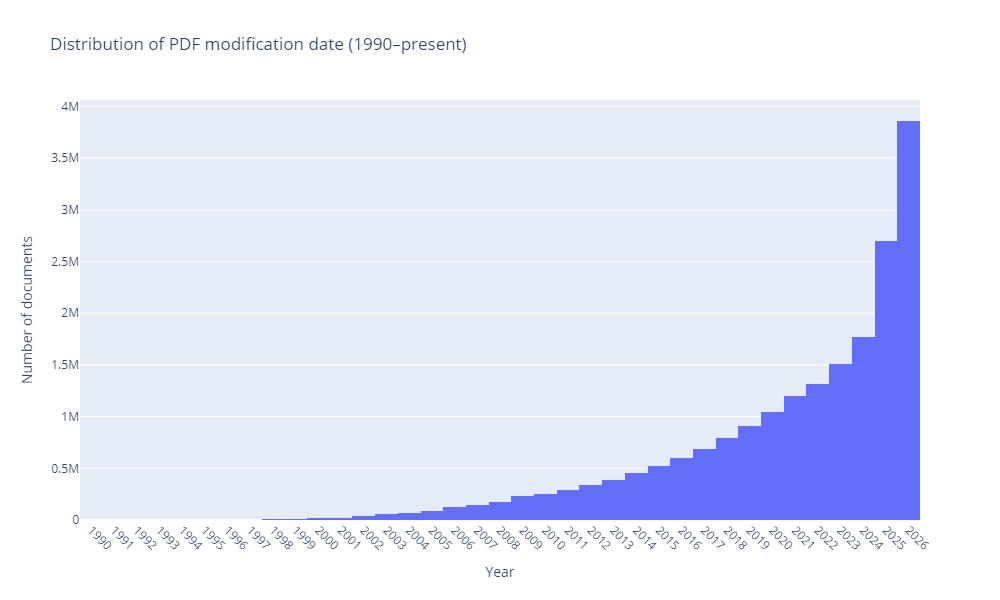
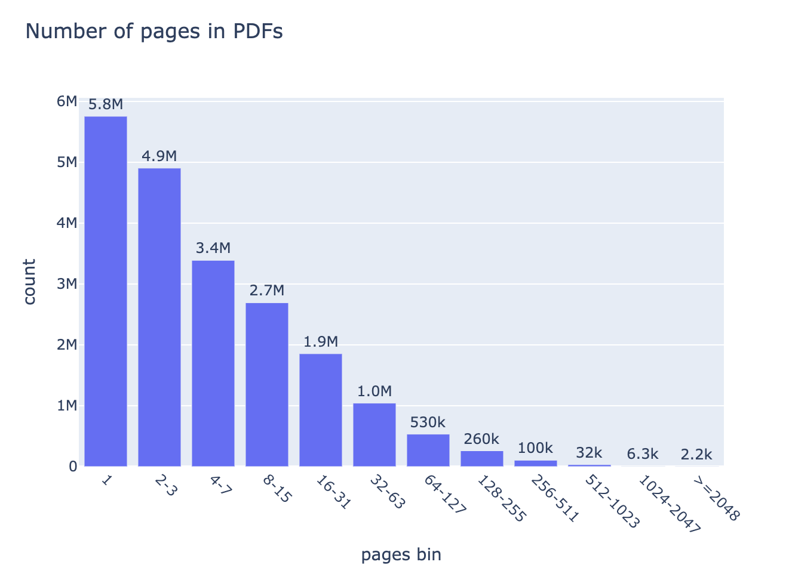
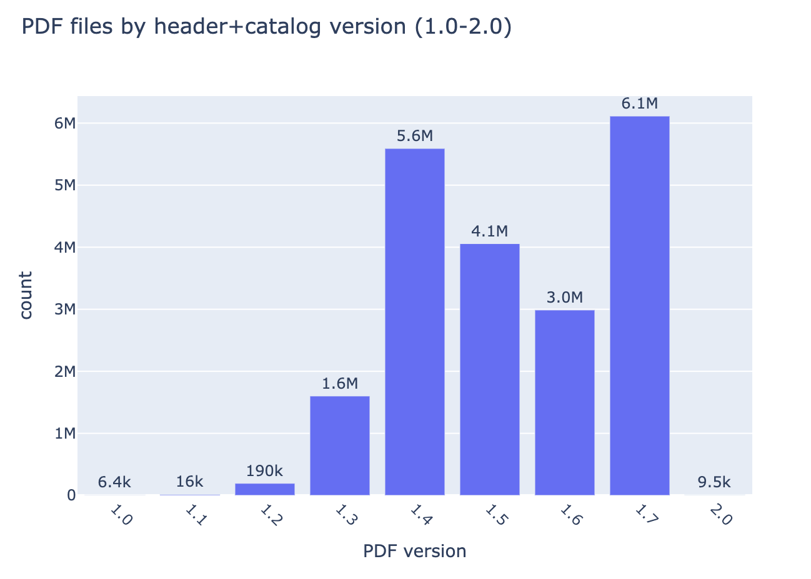
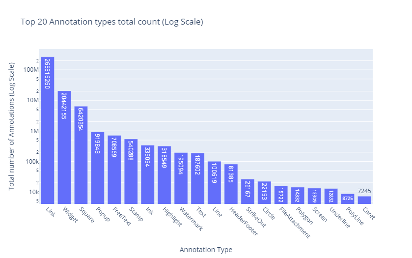
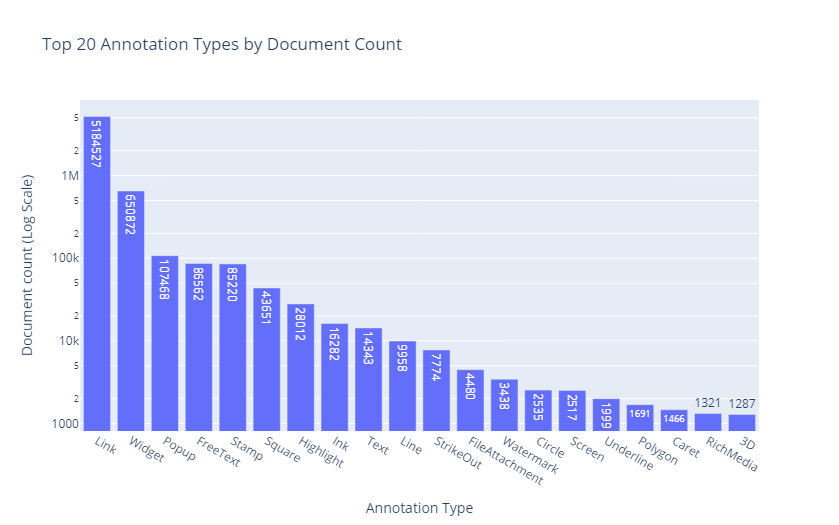
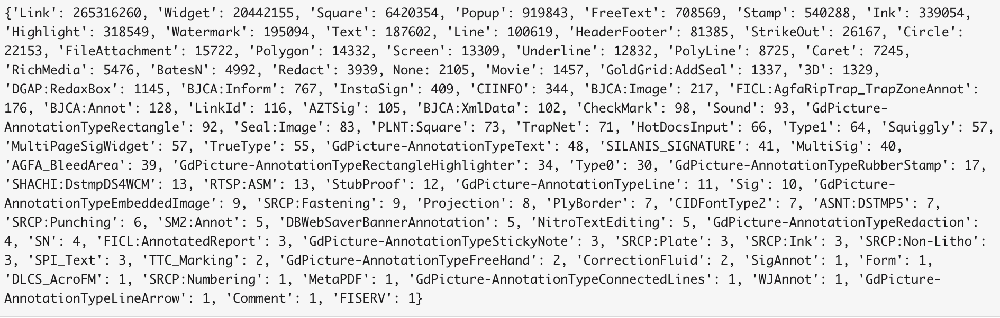
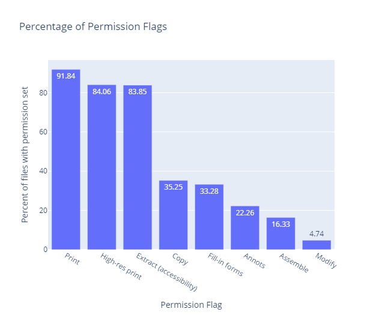

# PDF trends 2026Q2 by Dual Lab company 

## Analysis of 20.6 Million PDF Documents from the June 2026 Common Crawl Dataset

## Executive Summary

PDF remains one of the most widely used formats for publishing digital information, yet accessibility continues to be a major challenge. To better understand the current state of PDF accessibility, [Dual Lab](https://duallab.com/) analyzed the complete June 2026 Common Crawl dataset (CC-MAIN-2026-25), containing **20,578,394 PDF documents**.

This report extends [our previous study](https://pdf4wcag.com/blog-news/dual-lab-launches-reports-on-pdf-accessibility-trends) of approximately **15 million PDFs** from CC-MAIN-2026-04 and presents new data on encryption, permission flags, document size, page counts, annotations, PDF versions, and document age.

The analysis provides a large-scale view of how PDF technology is used across the public web and establishes a foundation for future reports on PDF in general with focus on Tagged PDF, PDF/UA adoption, and accessibility trends.

## Research Scope and Methodology 

The study analyzed every PDF referenced in the [**June 2026 Common Crawl**](https://commoncrawl.org/blog/june-2026-crawl-archive-now-available) **(CC-MAIN-2026-25)** dataset.

Because Common Crawl stores only the first **1 MB** of each PDF, documents exceeding this size were downloaded directly from their original URLs to enable complete analysis.

**The final dataset contains:**

* **20,578,394 PDF documents**  
* approximately **38 TB** of source data

**For each PDF we extracted:**

* basic metadata:  
  * page count  
  * file size  
  * creation and modification dates  
  * PDF version (including Version entry in the document catalog)  
  * producer and creator  
* encryption information and permissions  
* annotations  
* presence of interactive forms  
* presence of optional content layers  
* presence of digital signatures  
* image only (scanned) pages  
* Tagged PDF information:  
  * stats on the use of structure element types  
  * logical structure tree validation against **ISO 32005**

**The dataset contains:**

* **1,905,490** PDFs (9.26%) with **interactive forms**  
* **419,069** PDFs (2.04%) with **digital signatures**  
* **888,237** PDFs (4.32%) with **optional content (layers)**

<h3 style="text-align: left">Distribution of PDF documents by date</h3>

To understand the distribution of documents by timeline we analyzed document dates using **ModDate** when available; otherwise, **CreationDate** was used.

Because PDF metadata is not always reliable, the analysis was limited to documents dated between **1990 and June 2026**. Approximately **974,000** files (about **5%**) were excluded because their dates were missing, had invalid syntax, or were outside this range.

  Figure 1. Distribution of PDF modification date, 1990–2026

Most publicly available PDFs from June 2026 Common Crawl dataset were created or modified within the last several years.

<h3 style="text-align: left">Distribution of page counts in PDF Files</h3>

  Figure 2. Number of pages in PDFs

Most PDFs published on the web are relatively short.

Single-page documents represent the largest group (**5.8 million files**), followed by:

2–3 pages (**4.9 million**), 4–7 pages (**3.4 million**), 8–15 pages (**2.7 million**).

Document frequency decreases steadily as page count increases.

**Methodological note.** Around 8000 PDFs had malformed page trees resulting in missing page information. They were excluded from the page-count analysis. 

<h3 style="text-align: left">Distribution of PDF Files by PDF Version</h3>

The reported PDF version was determined using both the document header and the optional **/Version** entry in the Catalog, as defined in PDF 2.0 ( ISO 32000-2).

Only valid PDF versions were included. During processing, **81** documents with invalid version numbers (for example, 1.8, 1.9, 2.3, 7.0, 112.0, and 990.0) were excluded.

PDF 1.7 remains the dominant version with more than **6 million documents**, followed by: PDF 1.4, PDF 1.5, PDF 1.6. Together these four versions account for the majority of PDFs on today's web.

  Figure 3. PDF files by by header+catalog version (1.0-2.0)

<h3 style="text-align: left">Total Number of Annotations by Type</h3>

Annotations are one of the most widely used interactive features of the PDF format. Across the **20.6 million PDF documents** analyzed, we identified hundreds of millions of annotations of different types. 

The three most common annotation types are:

* Link — **265.3 million**  
* Widget — **20.4 million**  
* Square — **6.4 million**

Other frequently used annotation types include Popup, FreeText, Stamp, Ink, Highlight, Watermark, and Text.

  Figure 4. Top 20 Annotation types total count

**Figure 4**  presents the total number of annotations of each type across all analyzed PDF documents. The Figure is displayed on **a logarithmic scale,** allowing less frequent annotation types to remain visible and enabling meaningful comparison across the full distribution.

  Figure 5. Top 20 Annotation Types by Document Count

**Figure 5** shows Top 20 Annotation Types by the number of documents in which they appear. The vertical axis is plotted on a logarithmic scale.

Besides the annotation types defined by the PDF specification (such as Link, Text, Highlight, or Stamp), the dataset contains dozens of proprietary subtypes created by specific PDF applications and workflows, such as BatesN, InstaSign, MultiSig, SILANIS_SIGNATURE, GoldGrid:AddSeal, TrapNet, and numerous specific annotations generated by products such as GdPicture, BJCA, FICL, and others.  

  Figure 6.  Full list of annotation types by document count

<h3 style="text-align: left">PDF Encryption and Permission Flags</h3>

  Figure 7. Percentage of Permission Flags

Only **513,342 documents (2.5%)** were encrypted with an empty open password. The page-count analysis excludes malformed PDFs with missing page information and **80,062 password-protected PDFs** with unknown passwords. For encrypted documents with empty open passwords we analyzed the permission flags stored in the PDF encryption dictionary.

The majority of encrypted PDFs permit normal document use.

* Printing — **91.8%**  
* High-resolution printing — **84.1%**  
* Accessibility text extraction — **83.9%**

The high percentage of documents allowing accessibility extraction is encouraging because the PDF specification defines this permission independently of general content copying, allowing assistive technologies to access document text even when copying is prohibited.

However, approximately **16%** of encrypted PDFs, or **0.4%** of the total analyzed document count, disable accessibility extraction (this permission flag was deprecated in PDF 2.0), potentially creating unnecessary barriers for users of screen readers and other assistive technologies.

Overall, encrypted PDFs on the public web are primarily configured to prevent document modification rather than document access.

## Implications of analysis

This first part of the June 2026 Common Crawl PDFs analysis reveals several long-term characteristics of PDF usage on the public web:

* Most PDFs remain relatively small, short documents.
* Encryption is uncommon and generally does not prevent document access.
* Accessibility text extraction is enabled in most encrypted documents, although a significant minority still disables it.
* PDF 1.7 continues to dominate document production.
* Proprietary extensions remain common, particularly in annotation workflows.
* Link annotations dominate all other annotation types combined.

## Conclusion

This first part of the  report provides an initial statistical overview of more than **20.5 million** PDF documents collected from the June 2026 Common Crawl dataset.

The findings establish a baseline for understanding how PDFs are created, distributed, and protected on today's web. 

Stay tuned. In the next parts we analyse the evolution of a median size of PDF documents for the past 20 years, top producers of PDFs,  and Tagged PDF trends.
