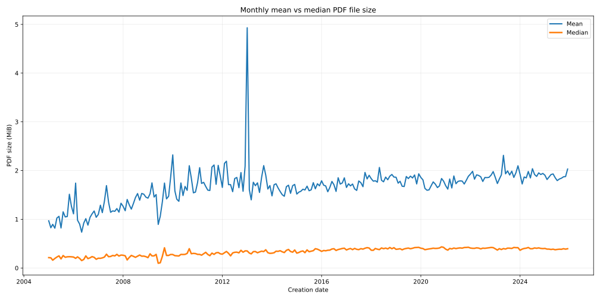
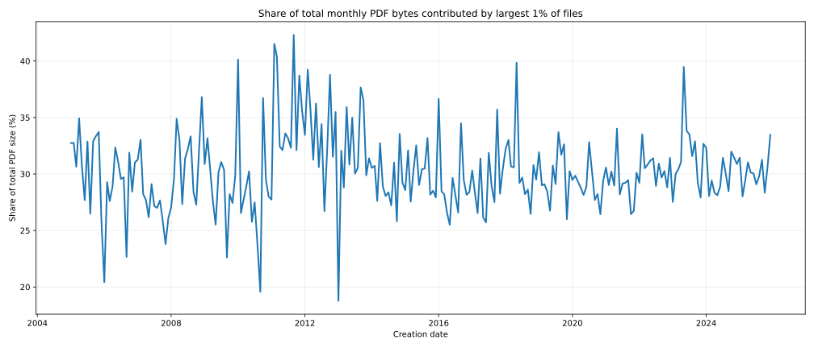
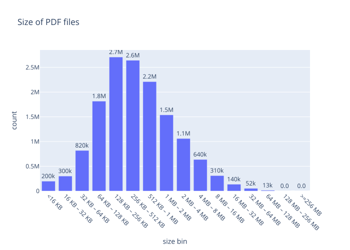
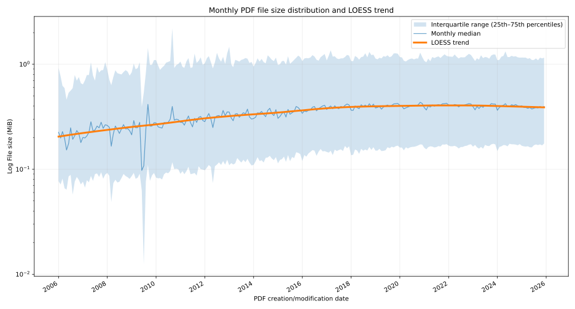
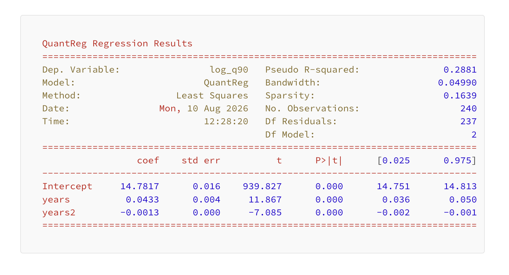
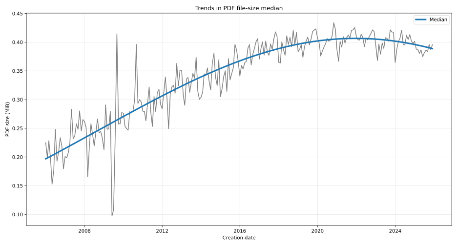
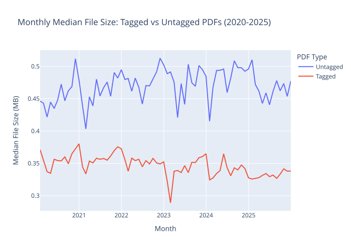

# Analysis of PDF file size for 2006-2025 by Dual Lab 

[**Dual Lab**](https://pdf4wcag.com/company/) analyzed the complete [June 2026 Common Crawl dataset](https://pdf4wcag.com/blog-news/PDF-trends-2026Q2-by-dual-lab-company) (CC-MAIN-2026-25), comprising **20,578,394 PDF documents**. In the second part of the analysis we analyze the evolution of the median PDF file size over the past 20 years.       

## Executive Summary

One of the reasons for the ongoing development of the [**Brotli compression**](https://pdfa.org/brotli-compression-coming-to-pdf/) in PDF format is the growing size of modern documents. It would be reasonable to assume, therefore, that PDF files are growing substantially larger. However, our analysis indicates otherwise.

[**Brotli compression**](https://pdfa.org/brotli-compression-coming-to-pdf/) has been introduced into the PDF specification to improve compression efficiency and reduce file sizes, particularly for modern workflows that embed large amounts of data and resources.

Despite these technological advances, our analysis tells a different story about the actual size of PDF documents published on the web.

This publication in no way diminishes the importance of Brotli. We fully recognize its value, while *noting that PDF archive sizes remain an important consideration for storage, transfer, and processing efficiency.*

## Use median instead of arithmetic mean

Because PDF file sizes span several orders of magnitude, the arithmetic mean can be strongly affected by a relatively small number of exceptionally large files. 

**Figure 1** below compares the mean with the median file size per each month for the past 20 years. It shows that the monthly mean is roughly 3-5 times the median for much of the period. More importantly, the mean has large isolated excursions, most dramatically around 2012-2013, where it jumps to almost 5 MiB, while the median hardly reacts.

  Figure 1. Arithmetic mean versus median

**Figure 2** quantifies this particularly well: the largest 1% of PDFs account for roughly 25-35% of all bytes in a typical month, with occasional values around 40%. One percent of observations contributing around one third of the quantity being averaged means the arithmetic mean is inherently highly sensitive to that 1%.

  Figure 2. Share of largest 1% of PDFs

 

To account for the skewed distribution and the influence of outliers, we complement the mean with the **median**, **25th–75th percentiles (interquartile range)**, and **10th–90th percentiles**. This combination distinguishes changes in the overall average file size from changes in the size of a typical PDF.

## Use Logarithmic scale for PDF File sizes

PDF document sizes vary by several orders of magnitude, from small text documents to publications containing thousands of pages and high-resolution images. To understand this distribution, **Figure 3** presents PDF file sizes using exponentially increasing bins (powers of two).

  Figure 3. Size of PDF files

 

**Using powers of 2 for the bins reveals an approximately log-normal distribution, making logarithmic scales more suitable than linear ones for analyzing PDF file sizes.** Since file sizes grow multiplicatively, this approach provides a more accurate view of the distribution across the full range of document sizes.

This again reconfirms the reason why we use the mean to examine overall changes in average file size, and the median and quartiles to assess long-term changes in typical PDF size.

## Evolution of monthly median and quartiles

Based on the above reasons, we perform long term analysis of the **median** file size together with the **25th–75th percentiles (interquartile range)**.

  Figure 4. Monthly PDF file size distribution

 

**Figure 4** shows the monthly evolution of PDF file sizes over the past 20 years using the **median** and the 25-75 **quartiles** on a **logarithmic scale**. The median and interquartile range provide a more robust representation of typical PDF sizes and their variation over time.

## Use quadratic regression instead of linear

**Figure 4** suggests that the growth in median PDF file size is **nonlinear**. The increase was most pronounced between **2006 and 2016**, after which the trend gradually flattened and even showed a slight decline in recent years. To model this behavior more accurately, we fitted a **quadratic regression** using the formula 

log_median ~ years + years^2

The standard regression analysis shows that both the linear and quadratic terms are highly statistically significant (*p* < 0.001), confirming that the evolution of PDF file sizes cannot be adequately described by a simple linear trend. The regression results are presented in **Figure 5**.

  Figure 5. Regression results

 

**Figure 6** illustrates the monthly median PDF file size together with the fitted quadratic trend. The gray line shows the observed monthly median values, while the blue curve represents the fitted regression model. 

Despite noticeable month-to-month variation, the long-term trend is clear. The monthly median PDF file size increased steadily from approximately **0.20 MB in 2006** to just over **0.40 MB around 2021–2022**, after which the trend leveled off and began to decline slightly. This suggests that the continuous growth in PDF file sizes observed over the previous decade has slowed, indicating that the typical size of PDF documents published on the web has stabilized in recent years.

  Figure 6. Trends in PDF file-size median

 

## Annual growth of median file size in values (percentage)

The quadratic regression model also reveals a clear slowdown in the annual growth of median PDF file size. The median increased by approximately **9.2%** between 2006 and 2007, but the annual growth rate gradually declined over time, falling below **1%** by 2020–2021. Since 2022, the trend has become slightly negative, indicating that the median PDF file size has stabilized and is beginning to decrease modestly. These results suggest that the long-term growth in PDF file sizes observed during the 2000s and 2010s has largely reached a plateau.

**Annual increase of median file size (percentage):**

<ul style="font-family: monospace; font-size: 16px; list-style: none; padding-left: 0;">
    <li>2006-2007: <b>9.21%</b></li>
    <li>2007-2008: <b>8.59%</b></li>
    <li>2008-2009: <b>7.97%</b></li>
    <li>2009-2010: <b>7.36%</b></li>
    <li>2010-2011: <b>6.75%</b></li>
    <li>2011-2012: <b>6.14%</b></li>
    <li>2012-2013: <b>5.54%</b></li>
    <li>2013-2014: <b>4.94%</b></li>
    <li>2014-2015: <b>4.34%</b></li>
    <li>2015-2016: <b>3.75%</b></li>
    <li>2016-2017: <b>3.16%</b></li>
    <li>2017-2018: <b>2.57%</b></li>
    <li>2018-2019: <b>1.99%</b></li>
    <li>2019-2020: <b>1.41%</b></li>
    <li>2020-2021: <b>0.83%</b></li>
    <li>2021-2022: <b>0.26%</b></li>
    <li style="color: #c35149; font-weight: bold;">2022-2023: <b>-0.31%</b></li>
    <li style="color: #c35149; font-weight: bold;">2023-2024: <b>-0.88%</b></li>
    <li style="color: #c35149; font-weight: bold;">2024-2025: <b>-1.44%</b></li>
    <li style="color: #c35149; font-weight: bold;">2025-2026: <b>-2.00%</b></li>
</ul>

## Median file size of Tagged vs. Untagged PDFs

During the reserch we have analyzed the median file size of Tagged versus Untagged PDFs. Initial guess was that Tagged PDFs should be larger in average, as PDF structure tree adds more objects to the document. However, this turned completely wrong! **Figure 7** shows that Tagged PDFs are systematically smaller than Untagged ones.

  Figure 7. Tagged vs Untagged PDFs

 

To be absolutely sure, we applied the [Wilcoxon signed-rank test](https://en.wikipedia.org/wiki/Wilcoxon_signed-rank_test), a non‑parametric statistical test, which shows statistically significant difference in median file sizes between tagged and untagged PDFs per month (P-value = 1.65875e-13). 

It is not clear why Tagged PDFs turn out to be smaller in average. One of the conjectures is that Tagged PDFs are mostly digitally born and do not include scanned files, which tend to be larger. We shall analyze this conjecture in the next parts of our analysis report.   

## Conclusions

Analysis of more than **20.5 million PDF documents from June 2026 Common Crawl collection** leads to several key findings.

* PDF file sizes follow an approximately **log-normal distribution**, making logarithmic visualization and median-based statistics more appropriate than arithmetic averages.   
* Median file size increased steadily until approximately 2021, after which growth flattened and became slightly negative.   
* Quadratic regression confirms that this slowdown is highly statistically significant.   
* The evidence suggests that the typical PDF published on the web has not become substantially larger over time.
* Despite initial guesses, Tagged PDFs turn out to be smaller in average than Untagged ones. 

These findings demonstrate the value of large-scale empirical analysis. Although technologies such as Brotli address the needs of increasingly sophisticated PDF documents, the overall characteristics of publicly available PDFs have remained remarkably stable.

In the next parts of our PDF analysis we shall discuss distribution of PDFs by Producer and the statistics on the use of structure elements and the validity of the structure tree against schemas defined in PDF standards.
