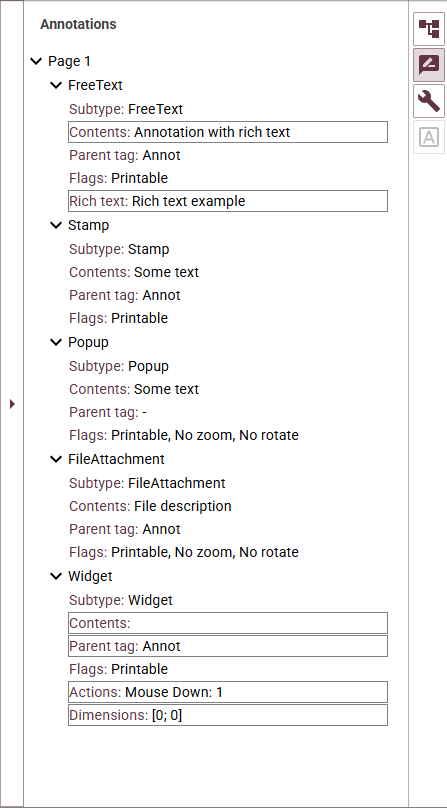
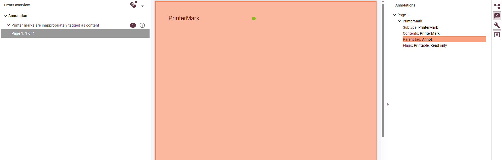
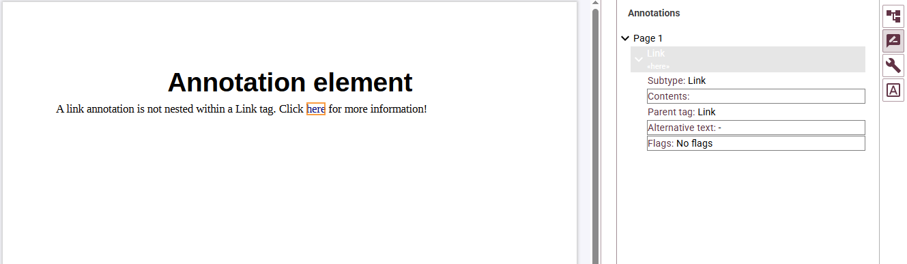

# How does the annotations panel improve PDF accessibility validation 

Annotations are a general mechanism for adding an interactive layer to PDF documents. They include elements such as links, comments, interactive form fields, multimedia, and more. Like all other content, annotations may or may not be accessible. PDF4WCAG checks also cover a number of PDF/UA and WCAG requirements on annotations.

**PDF4WCAG Accessibility Checker 1.10** introduces a dedicated Annotations panel that gives users deeper insight into interactive elements critical for accessibility compliance.

The panel inspects all types of PDF annotations relevant to usability evaluation, including:

- **Comments** – user notes and markup
- **Hyperlinks** – navigation and reference links
- **Form controls** – interactive form fields
- **Other interactive elements** – additional dynamic content

## The importance of  annotation inspection 

The Annotations panel provides visibility into the most common accessibility failures related to PDF annotations, including:

- **Untagged links**: users can identify untagged links annotations, which lead to  accessibility issues: screen readers treat it as plain text or ignore it entirely.  
- **Missing form labels**: users can identify forms with missing labels.  
- **Incorrect inclusion of annotations** **into the structure tree**: users can identify annotations whose parent tags are missing or not in the correct position within the document structure.  
- **Alt text**: users can quickly see which annotations have missing or empty alt text.  
- **Forbidden annotation types**: users  can identify annotation types that are not allowed in the accessible PDF documents.

The new annotations panel helps users quickly identify these issues, supporting compliance with WCAG and PDF/UA requirements. 

## Persistent preferences

Configuration settings are now persisted between sessions, meaning any custom filtering or view states the user applies to his annotation checks will be remembered the next time the user opens the tool.
