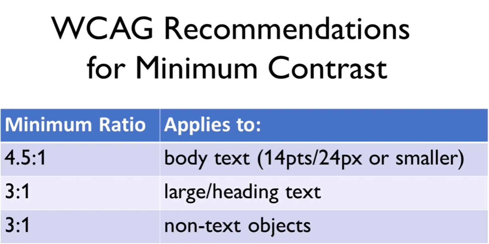
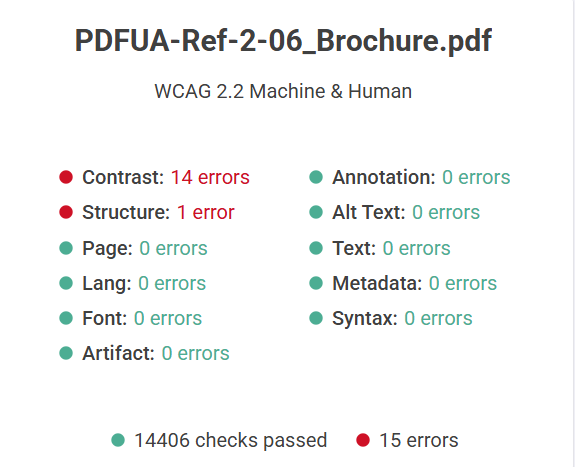
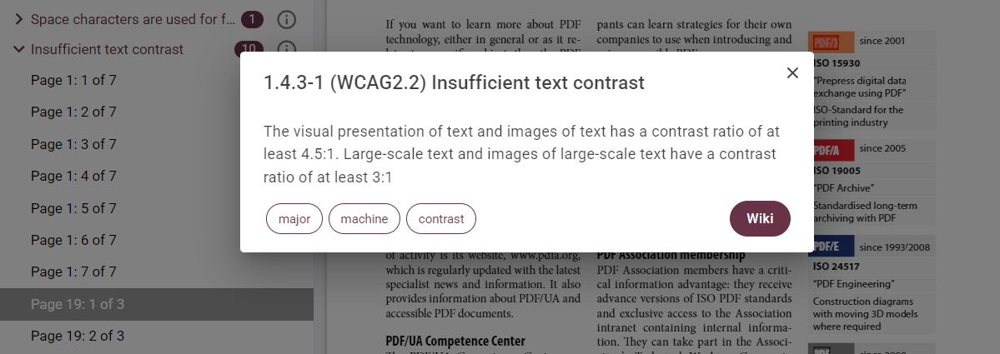
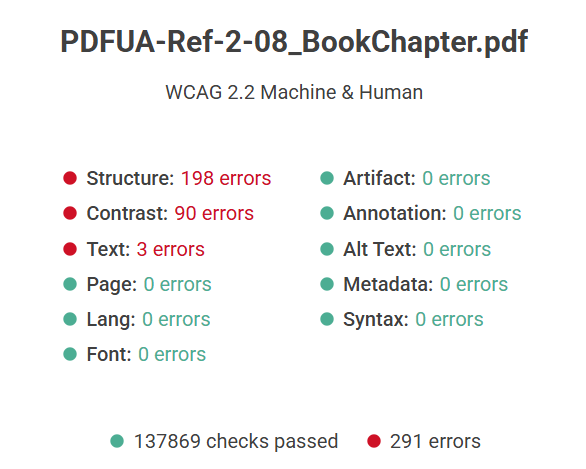
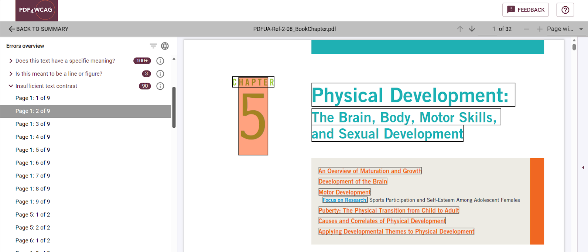

# How to check color contrast in PDF documents

Digital content, like PDF files, has to follow certain color contrast ratios so that people who have trouble seeing or understanding colors can still read it. WCAG includes specific requirements to ensure sufficient color contrast for text.

A key difference between WCAG and PDF/UA is that WCAG includes contrast requirements, which are generally not addressed by PDF/UA standards but remain essential for ensuring PDF accessibility.

**PDF4WCAG** comprises these contrast checks into both its WCAG 2.2 Machine and Human profiles and implements full support for all PDF color models when computing the color contrast.

The [contrast ratio of 4.5:1](https://www.w3.org/WAI/WCAG22/Understanding/contrast-minimum.html) was set to support users with vision loss equivalent to 20/40 vision. The contrast ratio of 7:1 was established to support users with vision loss equivalent to 20/80 vision.

While these requirements are well established for web content, applying contrast checks to PDF documents is significantly more complex.

**Expanded Color Models:** PDFs support complex color spaces (**CMYK, Lab, Indexed**, **Separation**, etc.) that require conversion to a perceptually uniform space like **CIELAB** for accurate contrast calculation.

**Device-Dependent Colors:** Colors defined as **DeviceRGB, DeviceCMYK, or DeviceGray** depend on the output device’s calibration, making their rendered appearance — and therefore contrast — variable.

**Complex Backgrounds:** PDF text is often placed over **gradients, images, patterns, or multi-colored backgrounds**, making it impossible to isolate a single background color for a standard contrast check.

Accurate WCAG contrast checks require resolving complex PDF color spaces, determining the effective background behind text, and accounting for differences in how PDF viewers render colors.

As a result, **color contrast checks** in PDF are inherently less predictable and more challenging than in web environments. 

PDF accessibility checker **PDF4WCAG** performs contrast analysis by interpreting the full PDF rendering context rather than relying on simplified colour assumptions. 

To sum it up, PDF4WCAG includes full coverage of so-called Machine checks including WCAG color contrast requirements. Yet, full WCAG compliance requires manual review alongside automated checks, especially for complex cases.

