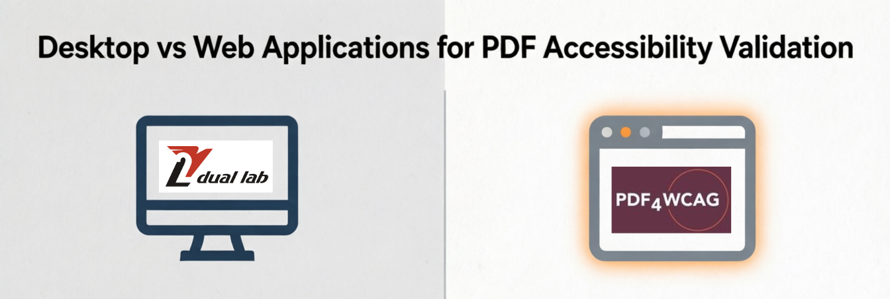
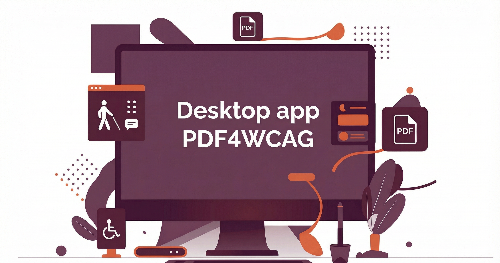

# Desktop vs Web Applications for PDF Accessibility Validation

Using PDF Accessibility Checker tools, we face the questions: **should it be a web application or a desktop application?** Each approach has clear advantages and limitations, especially when privacy and compliance are critical. Let’s choose the right approach together.

## The Case for Web Applications

Web applications are convenient. They run in any modern browser, require no installation, and are always up to date. Users can access them instantly, regardless of their operating system, making onboarding fast and effortless. Automatic updates mean there is no need to manage versions or worry about outdated functionality.

## Why Desktop Applications Matter

**Privacy is a major concern**. In regulated sectors such as government, healthcare, legal, and enterprise environments, uploading sensitive documents to external servers is often strictly prohibited. Regulatory requirements and data sensitivity often make cloud-based processing unacceptable. This is where desktop applications become essential.

Desktop applications can process documents locally without external data transfer. 

**PDF4WCAG: Web and Desktop together**

**PDF4WCAG** provides desktop versions for all major platforms, offering an identical user experience across operating systems (Windows, Linux, macOS). PDF4WCAG Desktop transfers the functionality of the web-based PDF4WCAG Accessibility Checker into a local environment keeping the same visual experience. It represents a desktop wrapper for the web application, enabling users to perform PDF accessibility validation directly on their computers without relying on an internet connection.

Desktop version of PDF4WCAG operates offline. It does not send or collect any data to the Internet or outside. As Web version, he desktop version also integrates with **veraPDF** validation engine, providing the same error previews, compliance reports, and interactive issue visualization as the online tool.

## Are Web and Desktop Versions absolutely the Same?

In practice, yes — almost entirely. Desktop wrapper for web application, same visual experience. The web and desktop versions of PDF4WCAG are 99% identical in terms of user experience. The core validation functionality is 100% the same across platforms. Minor differences exist only in how help and feedback mechanisms are implemented, not in how PDFs are analyzed or validated.

## A Compromise Solution for Enterprises

For organizations that want the convenience of a web application without sacrificing privacy, there is a middle ground. The web version of PDF4WCAG can be **installed within a corporate network using Docker images**. This allows companies to keep all document processing internal while still benefiting from a browser-based interface. The solution can even be customized to match corporate branding and workflows.

## Conclusion

There’s no single solution for choosing between desktop and web. Web applications offer convenience, while desktop applications ensure privacy. By offering web, desktop, and self-hosted options, PDF4WCAG lets organizations choose the approach that best fits their security, compliance, and usability needs—without compromising accessibility validation quality.

