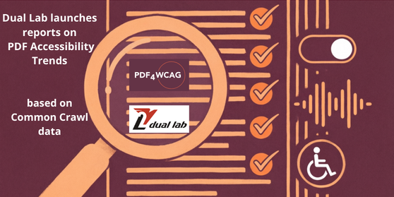
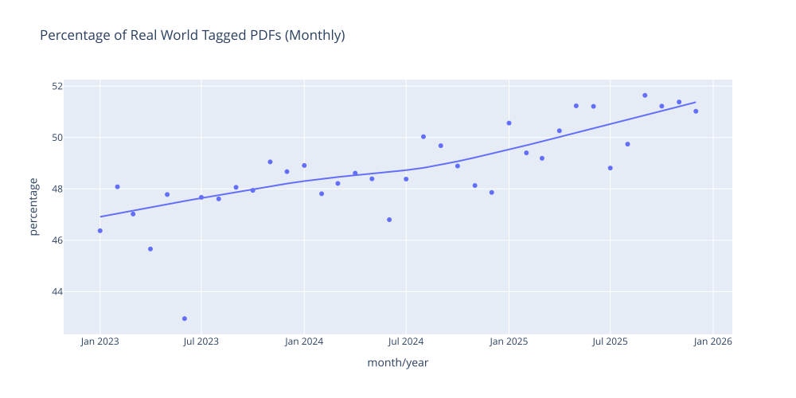

# Dual Lab launches quarterly reports on PDF Accessibility Trends based on Common Crawl data

[**Dual Lab**](https://duallab.com/) announces the upcoming publication of a new analytical report on PDF Accessibility Trends from  the [**Common Crawl**](https://commoncrawl.org/) dataset.  Such deep analytical reports will be released quarterly and will provide data-driven insights into global **PDF trends**. The first report  analyzes **15 million PDF documents** from the [**CC-MAIN-2026-04 Common Crawl**](https://data.commoncrawl.org/crawl-data/CC-MAIN-2026-04/index.html) archive.

## Mild growth of Tagged PDFs share

As a preview we present a sample report showing the share of Tagged PDFs among all PDFs in the **Common Crawl** dataset, grouped by the document creation month.

Our analysis shows a mild increase in the proportion of tagged PDFs over the past three years. The share has been growing by approximately **1.5 percentage points per year**, surpassing the significant milestone of **50% in mid-2025**.

This means that today, more than half of newly created PDF documents appearing in the Common Crawl archives include structure tree with semantic information.

## Why Tagged PDFs matter

Tagged PDFs contain a structure tree that defines headings, paragraphs, tables, figures, and other semantic elements. This structure is essential for:

* The ability of Screen readers to understand the document
* Logical reading order
* Compliance with accessibility standards such as **PDF/UA**
* Alignment with **WCAG** requirements

The growth in tagged documents indicates a positive global shift toward better structured and potentially more accessible PDF publishing.

## Trend in the share of Tagged PDFs among all PDFs

**Dual Lab** analyzed 15 millions of PDF documents from the **Common Crawl** dataset CC-MAIN-2026-04 to examine how the share of tagged PDFs has changed over time.

The results show a clear rising trend over the past three years. The proportion of tagged PDFs documents containing a structural tag tree has increased steadily by approximately **1.5 percentage points per year**.

A key milestone was reached in **mid-2025 (July)**, when the share exceeded **50%** for the first time. This indicates that more than half of newly created PDF documents indexed **in Common Crawl** now include structural tagging.

The growth reflects broader adoption of structured document generation tools and increasing awareness of accessibility and machine-readability requirements. While the trend is positive, continued monitoring is essential to evaluate not only the presence of tags but also their structural quality.

## Reports by Dual Lab

**Dual Lab** aims to provide objective data that supports users, accessibility experts, and organizations working toward more inclusive digital content.

***The first full report will be published soon.***

**Reports will be available:** **Dual Lab** website, **PDF4WCAG** website, [Google Group Dual Lab Dual Lab Reports on PDF Accessibility Trends](https://groups.google.com/g/duallab); our channels in [X](https://x.com/PDF4WCAG) and [Linkedin](https://www.linkedin.com/company/3658503/admin/page-posts/published/).

