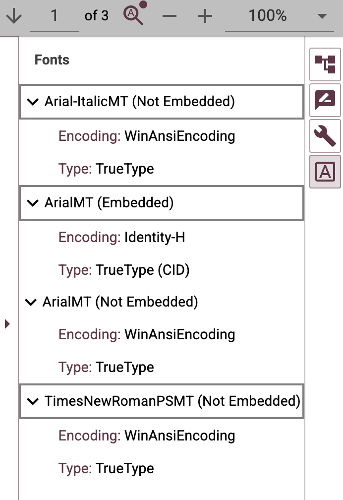
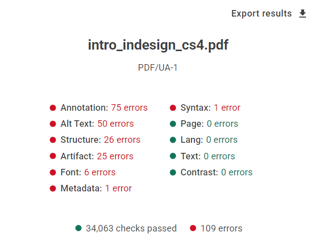
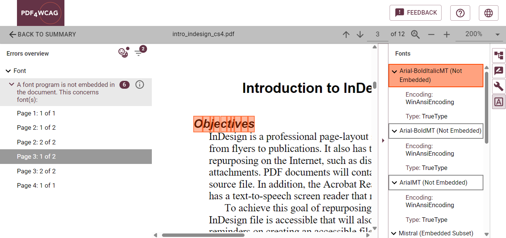
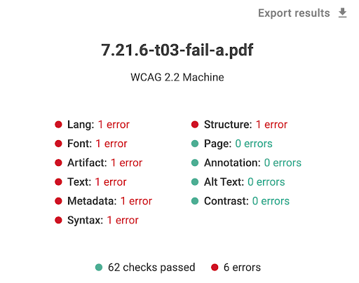
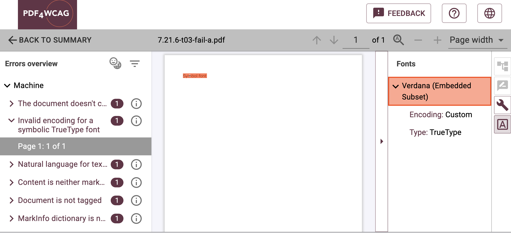

# The Fonts Panel in PDF4WCAG: supporting PDF accessibility and compliance

When it comes to PDF accessibility, fonts are far more than a design choice. They are an important technical component that affects how text is represented and interpreted by assistive technologies. One of the key additions in **PDF4WCAG Accessibility Checker 1.10** is the new Fonts inspection panel, which provides a detailed analysis of embedded fonts, font types and subsets, and encoding information. 

## Why fonts matter for accessible PDFs

For textual content, PDF/UA and Well-Tagged PDF (WTPDF) require text to be represented in a way that supports reliable Unicode extraction and interpretation by assistive technologies.

Proper font implementation helps ensure:

* Reliable text extraction   
* Searchable and selectable text   
* Accurate Unicode mapping   
* Reliable interpretation by assistive technologies

If font encoding or accurate Unicode character mapping is incorrect, text may appear correctly on screen while being interpreted incorrectly by assistive technologies or accessibility validation tools.

## What the Fonts panel shows

The new **Fonts** panel in **PDF4WCAG 1.10** provides detailed technical information about every font used in the document, including:

* **Embedded fonts** – displays information about fonts embedded in the document  
* **Font type and subset information** – displays the font type and whether a font is embedded as a subset or in full  
* **Encoding information** – provides information about font encoding to assist in diagnosing Unicode mapping issues

Users can immediately inspect all font resources from a single location. This makes troubleshooting much faster, especially in complex documents containing multiple embedded fonts. 

## How font information supports accessibility

Screen readers rely primarily on correctly encoded text, Unicode mappings, and the tagged PDF structure. Incorrect font encoding or missing **ToUnicode mappings** can prevent assistive technologies from interpreting text correctly, even when the document appears visually correct. This results in unreadable or skipped content for users with visual disabilities.

The  new **Fonts** panel in **PDF4WCAG Accessibility Checker 1.10** gives users direct access to essential font information that previously required specialized PDF inspection tools. By exposing embedded fonts, font types, subset status, and encoding information, it helps accessibility professionals diagnose problems more quickly and improve the technical quality of accessible PDF documents.

Combined with **PDF4WCAG's** validation engine, powered by the veraPDF architecture, the Fonts panel makes version 1.10 a more comprehensive accessibility validation solution.

Together with the new [Metadata](https://pdf4wcag.com/blog-news/metadata-and-pdf-accessibility) and [Annotations panels](https://pdf4wcag.com/blog-news/annotation-panel)  introduced in version **1.10 PDF4WCAG**, the Fonts panel provides deeper insight into the technical structure of PDF documents and supports more efficient accessibility analysis.
