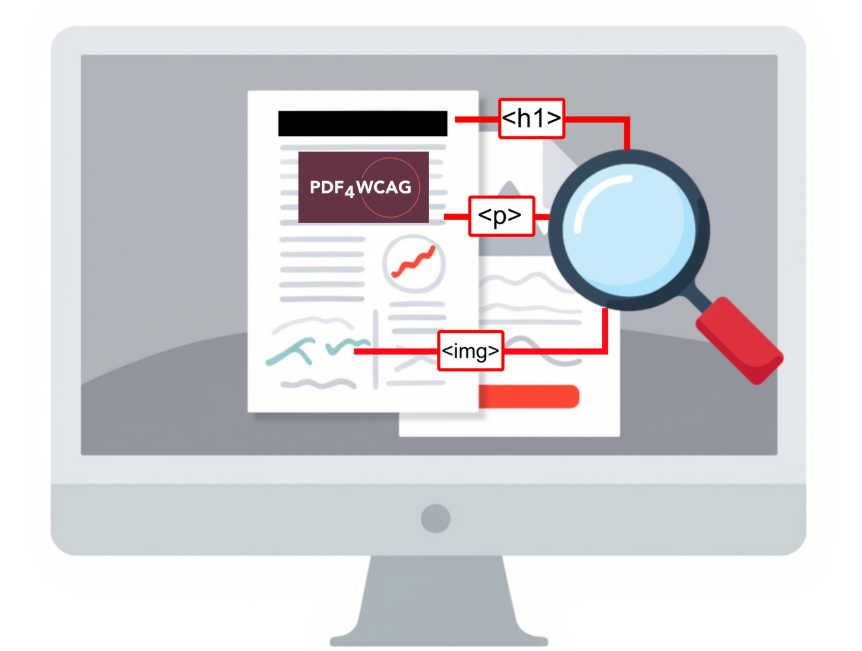
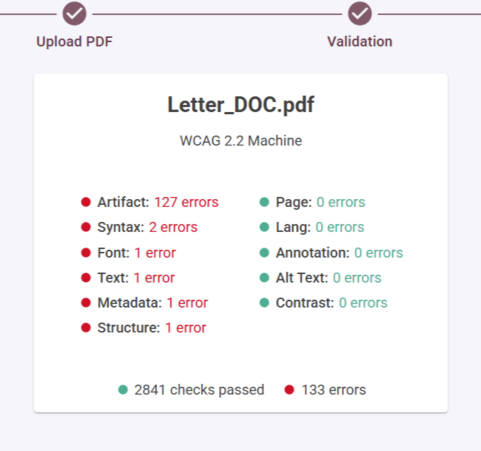
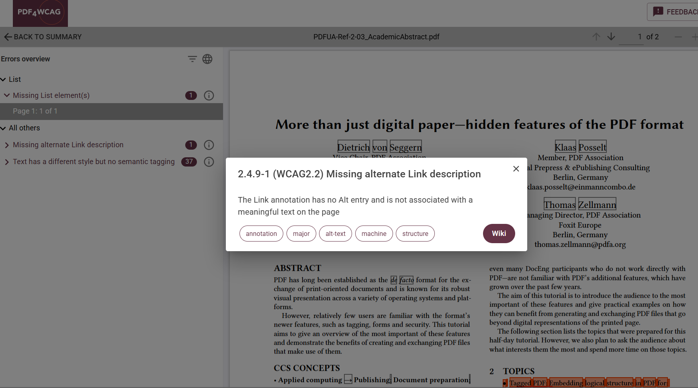
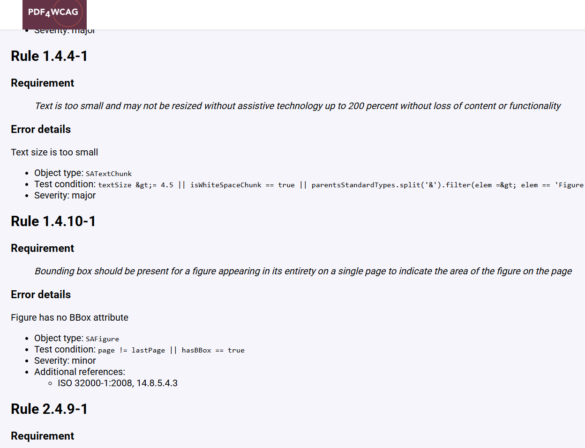

# Help improve accessibility error messages with PDF4WCAG

Digital accessibility standards are essential but often hard to interpret in practice. Validating PDFs is key to ensuring content is usable for everyone, including people who rely on assistive technologies. The PDF4WCAG accessibility checker helps bridge the gap between technical requirements and real-world implementation, though more work is needed to make validation results clearer and easier to understand.

## The Challenge: Technical Standards vs. Practical Understanding

Standards such as PDF/UA are written in dense, highly technical language. They are designed for precision and legal clarity — not for everyday usability.

**When a PDF accessibility checker reports validation errors,  they are typically:**

- Directly linked to specification clauses
- Worded in technical terminology
- Dependent on deep knowledge of PDF structure and object hierarchy

For many users — even experienced accessibility professionals — interpreting these errors requires additional knowledge about PDF internals, tagging structures, and document semantics.

## Why Validation Errors Are Hard to Interpret

There are several common pain points:

**1. Technical Language**

Validation messages often quote or paraphrase sections of standards without explaining them. 

**2. Unclear Severity**

Not all errors have the same impact. Some issues completely block accessibility; others represent best-practice violations. 

**3. No Fix Recommendations**

Many validation tools stop at identifying the problem. They do not explain:

- Why this matters for users
- What assistive technology behavior is affected
- How to fix the issue in authoring tools
- Whether the fix is mandatory or advisory

For users, it means a significant gap between “what is wrong” and “what should I do next?”

## How PDF4WCAG Tries to Improve the Situation

PDF4WCAG attempts to make validation feedback more accessible and actionable by providing:

**Dual-Level Descriptions**

- **Technical descriptions (English only)** — closely aligned with specification language.
- **User-friendly localized messages** — currently available in:
  - English
  - German
  - Dutch

The localized messages aim to be clearer, more practical, and easier to understand for users who are not deeply familiar with PDF structure theory.

Despite these improvements, a significant gap remains. Even a well-translated error message is still just an error message — what users truly need is context and clear guidance.

## A validation report should be transformed into a learning and remediation tool language:

**WCAG Success Criteria**: Instead of just *“2.4.9-1 (WCAG2.2)  Missing element,”* the message can say, ***“2.4.9-1 (WCAG 2.2) Missing alternate Link description. The Link annotation has no Alt entry and is not associated with a meaningful text on the page.”***

**Real-World Impact:** Explain *who* this affects. "A person using a screen reader cannot navigate this document efficiently because of unclear purpose of the link"

**Step-by-Step Fixes:** Provide clear, plain-language instructions or links to a wiki on how to resolve the issue in the authoring tool

## What Accessibility Experts Really Need

An ideal validation message would include:

1. **What is wrong** (clear and concise)
1. **Why it matters** (user impact explanation)
1. **How severe it is** (blocking vs. advisory)
1. **Related WCAG requirements**
1. **How to fix it** (step-by-step or tool guidance)
1. **Examples or references**

Bridging this gap would dramatically improve both compliance workflows and real accessibility outcomes.

## Call for Contribution

Improving validation messaging is not just a technical task — it is a community effort.

Creating this bridge between a technical validator and a practical accessibility guide is a monumental task, but it’s not one that has to be solved by a single team. It requires a community effort.

**PDF4WCAG** team calls for contributing in:

🌍 **Localizations:** Help us translate error messages and guidance into more languages to make accessibility truly global.

✍ **Improving Formulations:** If you see an error message that is still confusing, suggest a better way to phrase it.

📚 **Building the Wiki on the validation errors:** Contribute to a knowledge base of articles that explain common errors, their impact, and step-by-step remediation guides.

**Want to help? Here’s how:**

- Contact us via email  pdf4wcag@duallab.com to express your interest or discuss collaboration;
- You can open discussions and submit [issues](https://github.com/duallab/PDF4WCAG-public/issues) in our public GitHub repository or start the [discussion](https://github.com/duallab/PDF4WCAG-public/discussions) to propose improvements or share ideas.

Together, we can make PDF accessibility validation not just technically accurate — but truly understandable and practical.

***PDF4WCAG has started that journey — now it needs the community to help close the gap.***
