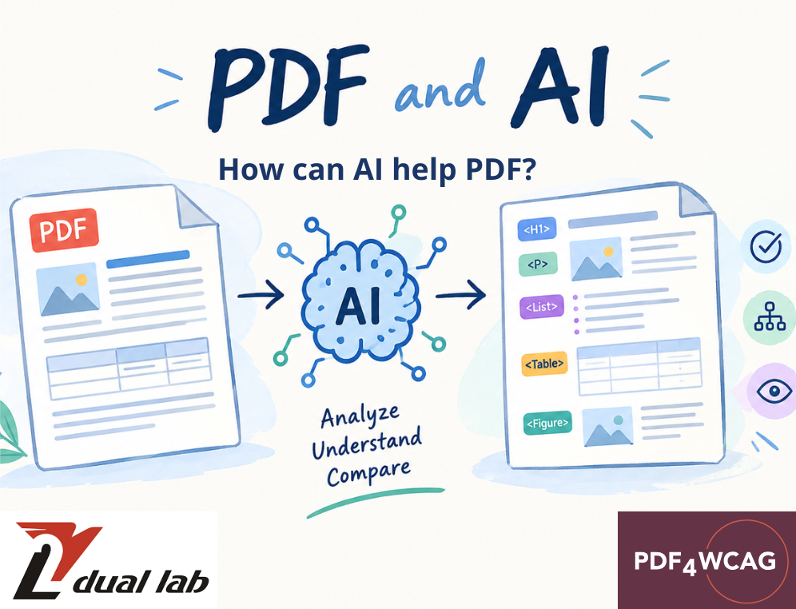

# How can AI help PDF?

PDF is widely used for research papers, reports, manuals, contracts, and other documents. When PDFs become input for AI systems, the question is not only how text is extracted, but also whether the document's visual and semantic structure is preserved.

This is particularly important for PDF accessibility. [PDF/UA](https://pdfa.org/resource/iso-14289-pdfua/) and [WCAG](https://www.wcag.com/) define accessibility requirements, while the [Matterhorn Protocol](https://pdfa.org/resource/the-matterhorn-protocol/) describes many machine-checkable PDF/UA conditions. However, some accessibility checks require understanding the document's visual organization and comparing it with its semantic structure. This is where [PDF4WCAG](https://pdf4wcag.com/) uses AI to support human-oriented accessibility checks.

The article [*Is PDF a Problem for AI*](https://pdf4wcag.com/blog-news/is-pdf-a-problem-for-ai) provides an important starting point: PDF itself is not inherently unsuitable for AI. The challenge is that a PDF can contain different layers of information, while an AI ingestion pipeline may preserve some and discard others.

## PDF is more than extracted text

PDF is a page-oriented document format designed to preserve content and appearance across systems. Its visual representation does not necessarily describe the semantic role of every element.

A heading may look like a heading to a human but have no corresponding heading tag. A list may appear visually as a list while being represented as ordinary paragraphs. A table may be visually clear but have an incorrect or missing structural representation.

Tagged PDF can provide machine-readable information about headings, paragraphs, lists, tables, figures, reading order, language, and alternative text. However, the presence of a Structure Tree does not guarantee that it correctly represents the document. Tags can be incomplete or incorrectly assigned.

## Why Human checks are important

Machine-verifiable rules can check many technical accessibility requirements, but some checks require interpretation of the document's visual organization.

A human reviewer can recognize that:

- a large text block is a heading;  
- several lines form a list;  
- a group of cells forms a table;  
- an image is associated with surrounding content;  
- columns have a particular reading order;  
- an element belongs to a specific logical section.

Complex layouts make this interpretation more difficult. Multi-column pages, tables, footnotes, sidebars, figures, and content extending across page boundaries can require analysis beyond simple text extraction.

## How PDF4WCAG uses AI

[PDF4WCAG](https://pdf4wcag.com/) uses AI for [document layout analysis (DLA)](https://en.wikipedia.org/wiki/Document_layout_analysis) to support human-oriented accessibility checks.

The AI analyzes the visual organization of a PDF and identifies elements that appear to correspond to document structure. [PDF4WCAG](https://pdf4wcag.com/) then compares the AI analysis with the existing Structure Tree.

For example, if the visual analysis identifies an apparent heading, paragraph, list, table, or other structural element, PDF4WCAG can compare that result with the corresponding structure in the PDF.

This comparison helps identify potential inconsistencies between the visual layout of the document and its encoded semantic structure.

The process can therefore support part of the analysis normally performed during a human accessibility review: examining the document's visual organization and comparing it with its machine-readable structure.

## AI-assisted checks cannot replace Human review

AI analysis does not constitute a formal accessibility-conformance decision and does not replace human judgment. Its role is to help identify potential issues that may require further review.

This is relevant because the size or presence of a Structure Tree alone does not indicate its quality. [Dual Lab's analysis of 20,578,394 PDFs](https://pdf4wcag.com/blog-news/PDF-trends-2026Q2-by-dual-lab-company) found that structure trees are widespread, while large structure trees can still contain incorrect relationships or invalid parent-child combinations.

Tagged PDF is not automatically a correctly structured PDF.

## Conclusion

PDF is not inherently a problem for AI. The structure of a PDF needs to correspond to the content and organization presented to the user.

**PDF4WCAG** uses AI for document layout analysis and comparison with the existing Structure Tree. This provides additional evidence for human-oriented accessibility checks and helps identify potential inconsistencies between visual layout and semantic structure.

The purpose is to use AI to support the analysis of PDF accessibility, particularly where understanding the document's visual organization is required.
