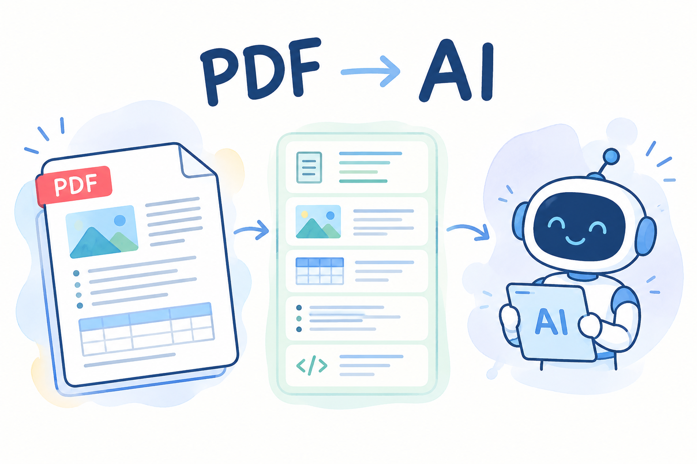

# Is PDF a problem for AI?

Every organization relies on documents: contracts, financial reports, research papers, compliance filings, insurance policies, technical manuals, and government records. Many of these documents are PDFs.

***But what happens when these documents become input for AI?***

An AI system may have access to a PDF, but it does not necessarily receive all the information contained in it. During ingestion, a document can be reduced to plain text, processed with OCR, analyzed page by page, or converted to Markdown. Tables can lose their relationships, reading order can change, annotations can disappear, and metadata or semantic structure can be ignored.

The result is a gap between what the PDF contains and what the AI system actually understands.

This is the real PDF problem for AI.

**But there is an important distinction:** PDF itself is not inherently a bad format for AI. The problem is often the way PDF is created, interpreted, and ingested.

## Why PDF can be challenging for AI

PDF is a page-oriented document format designed to preserve content and appearance across systems. But a standard PDF does not necessarily contain the semantic information that tells a machine what every piece of content means.

This creates several challenges:

1. **Visual structure does not always equal semantic structure:** PDF can describe text and graphics as positioned objects, but a visually obvious heading, list, or table is not necessarily represented with its logical meaning. Tagged PDF can provide additional information about logical reading order, headings, lists, tables, language, and alternative text, but not all PDF files are tagged.

2. **Scanned documents may contain no usable text layer.**  
   OCR may be necessary, but it introduces another recognition step and can produce errors.

3. **Complex layouts require interpretation.**  
   Multi-column pages, tables, footnotes, sidebars, figures, and content spanning page boundaries can be difficult to reconstruct from raw text.

4. **Text encoding can create problems.**  
   Poor Unicode mappings or malformed PDFs can make otherwise visible text difficult to extract reliably.

5. **More than visual rendering.**   
   PDF also contains metadata, bookmarks, digital signatures, attachments and other supplementary information which may be crucial for a user workflow, but is often ignored by AI. 

   So PDF is not “unreadable by machines.”

Rather, PDF can contain several layers of information, and AI systems do not always extract all of them. 

## The PDF AI actually receives may not be the PDF you created

This is one of the most important points in the [PDF Association FAQ](https://pdfa.org/faq-ai-and-pdf/).

Different AI systems use different PDF ingestion strategies. Some systems may ignore bookmarks, layers, annotations, metadata, or Structure Tree. Others may apply OCR even when the PDF already contains extractable text. Some reduce the entire document to a stream of plain text.  

If the ingestion pipeline extracts only visible characters, the AI receives only a part of the document. That means two AI systems can receive the same PDF but effectively process different documents.

This can explain why one AI tool answers a question correctly while another misses a table, misunderstands reading order, or produces an incorrect answer.

## Tagged PDF can give AI a structural advantage

Tagged PDF gives AI important structural information, including headings, paragraphs, lists, tables, and figures. However, a structure tree does not guarantee perfect semantics; tags can be incomplete or incorrect.

This is similar to HTML, where semantic structure may also require additional technologies and guidance such as [WAI-ARIA](https://www.w3.org/WAI/standards-guidelines/aria/) and WCAG. In PDF, standards such as [WTPDF](https://pdfa.org/wtpdf/) and [PDF/UA](https://pdfa.org/resource/pdfua-flyer/) provide additional requirements for the quality of structured and accessible PDF documents.

Still, the fact that PDF creators added Tagged structure is a step forward and provides a potential source of valuable information for AI.

## OCR is not the universal solution

A common PDF-to-AI pipeline looks like this:

**PDF → OCR → text → LLM**

But, as the PDF Association says in its FAQ, not every PDF needs OCR.

Most born-digital PDFs already contain extractable text. For these documents, native text extraction is generally preferable to OCR. OCR is slower, more costly, and can introduce recognition errors. It also recovers only visible text and does not replace other PDF information such as annotations, metadata, semantic structure, or embedded content.

Native PDF extraction can also access information that OCR cannot reliably recover, including intended Unicode mappings, intended textual representations of images (ActualText), and text contained in annotations or other non-page content.

OCR remains important for scanned documents and situations where PDF text cannot be reliably extracted.

A better workflow is therefore:

**Detect → Extract native content → Analyze → OCR only when necessary**

OCR should be a fallback, not an automatic first step.

## Converting PDF to Markdown is not always better

Another popular workflow is:

**PDF → Markdown → LLM**

Markdown is easy for developers and language models, but converting every PDF into Markdown can be counterproductive. 

The PDF Association describes conversion to simpler formats as potentially lossy because PDF contains features that do not have direct equivalents in Markdown or HTML. Complex tables, merged cells, digital signatures, layers, annotations, and other semantics can be simplified or lost during conversion.

For a simple document, Markdown may be an excellent intermediate representation. But for a complex PDF, less structure does not necessarily mean better AI understanding.

The goal should not be to make the document as simple as possible. The goal should be to create a machine-readable representation while preserving meaningful information and relationships. 

## Page-by-Page processing can lose context

PDF is paginated, but the logical document is not necessarily organized around pages.

A sentence can continue onto the next page, or even several pages ahead. A table can span several pages, both vertically and horizontally. A heading can appear at the bottom of one page while its content begins on another. 

The PDF Association therefore advises against treating each PDF page as an independent AI input. Page isolation can reduce context and increase the risk of incorrect interpretation.

However, page information remains important for attribution and verification. A good AI system should preserve both logical document structure and physical page references.

This is especially important in [RAG](https://en.wikipedia.org/wiki/Retrieval-augmented_generation) systems, where users need to verify where an answer came from.

## Metadata, Annotations and Attachments Matter

A PDF ingestion system should not automatically discard metadata.

The PDF Association specifically recommends that AI systems make use of PDF metadata because it can contribute context and potentially reduce processing requirements.

Annotations are also important.They can represent comments, markup, links, digital signatures, multimedia, attachments, or proposed changes to document content. Ignoring them can mean ignoring information relevant to the document's context.

Attachments need not be referenced by annotations but are nonetheless part of the document; these must also be considered. 

## Redaction is a special AI risk

There is also an important security issue.

A correctly redacted PDF has the sensitive information removed. But a PDF containing redaction annotations may represent an incomplete redaction workflow; the underlying information may still exist in the file. A PDF may also contain other types of annotations that mask (but do not remove) text; a very common type of redaction failure. 

An AI system processing such a file could potentially ingest information that the author believed had already been removed. 

*Visual appearance is not the same as document state.*

## Very large, old, or invalid PDFs create additional challenges

PDF is designed to be backward-compatible, so even very old PDF documents can potentially be processed by modern systems. But malformed, truncated, or corrupted PDFs can behave differently depending on the software used to recover and interpret them. Different AI systems may therefore recover different information from the same damaged file.

AI processing can also be slower for PDFs than for HTML because PDFs are frequently long, multi-page documents. Unnecessary OCR adds additional processing overhead.

This is another reason that PDF-aware preprocessing matters.

## So, is PDF actually a problem for AI?

**Yes but !! not in the way it is usually described.**

PDF itself is not inherently unsuitable for AI.

In fact, PDF is valuable precisely because it often contains high-density, long-form, persistent information that organizations need AI to understand.

The real challenge lies in PDF ingestion processes.

If an AI system converts a complex PDF into an incomplete stream of text, it may discard the very information needed to interpret the document correctly.

## Conclusion

PDF is not the enemy of AI. PDF should not be automatically OCR-processed or converted into a simpler format just because image recognition is available or Markdown and plain text are easier to process. Such conversion can discard semantics, structure, and context.

The better approach is PDF-aware AI ingestion: preserve native text where available, use structural information such as Tagged PDF, retain relevant metadata and annotations, maintain page references, and use OCR only when necessary.

The goal is not simply to extract text from a PDF but to preserve all information within the document and all relationships that make the document meaningful.
