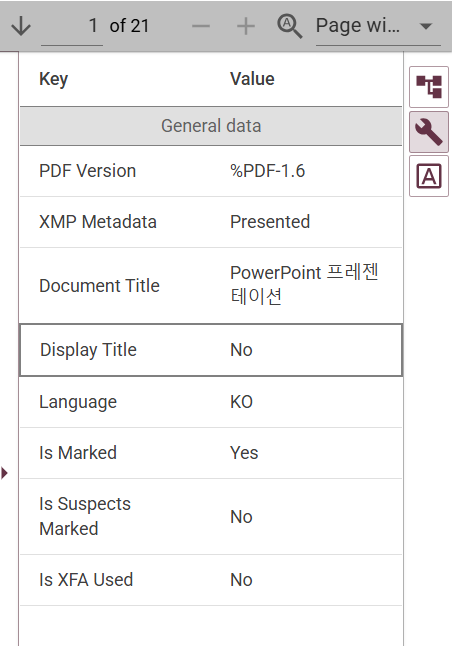
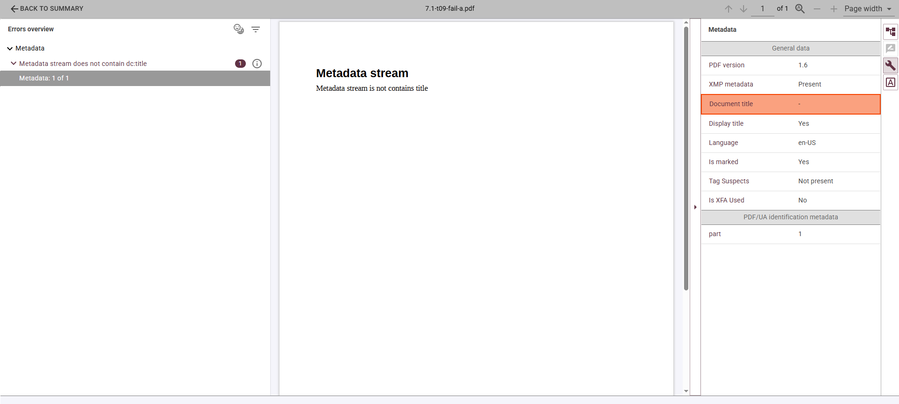
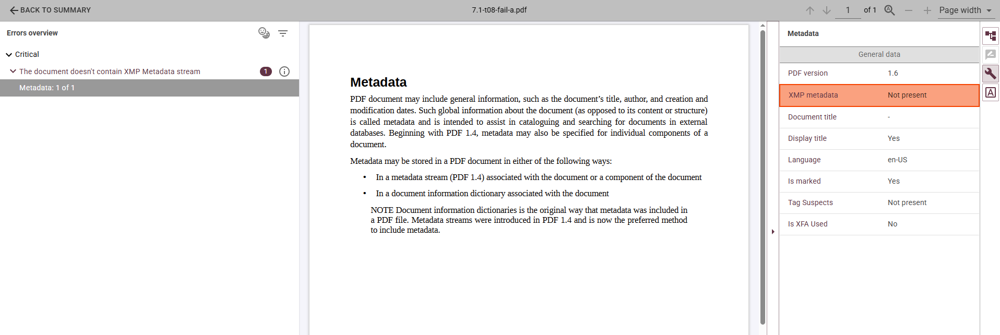
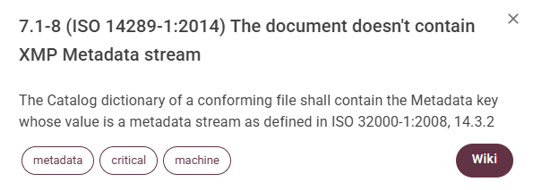
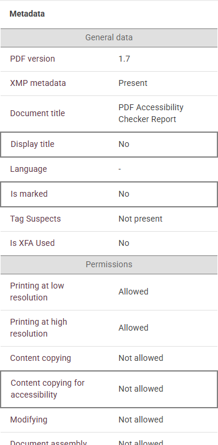

# Metadata and PDF accessibility. Why is PDF Metadata important for accessibility 

PDF accessibility is always associated with tags, headings and alternative text. But there's another critical component: **metadata**.

PDF documents may include general information, such as the document’s title, author, and creation and modification dates. Such information about the document (as opposed to its content or structure) is called **metadata** and is intended to assist in cataloguing and searching for documents in external databases.

Metadata plays a tremendous role in modern PDF files, especially in accessibility, document management and AI-based document processing. In PDF files metadata is commonly stored using **XMP (Extensible Metadata Platform) package, directly embedded into the document.**

## Document title and accessibility

*Well-Tagged PDF (WTPDF) declarations are metadata, embedded in PDF 2.0 files within the XMP metadata, that assert a document's conformity with [WTPDF 1.0 requirements](https://pdfa.org/wtpdf/) for accessibility or content reuse. Developed by the PDF Association, these declarations allow software to identify if a file is optimized for assistive technology (similar to PDF/UA-2) or for structured data extraction.*

The title helps users understand the purpose of the document before reading its content. Screen readers and other assistive technologies often announce the title when the PDF is opened.

**For example:**

“Accessibility Report 2026”   
“PDF4WCAG PDF Accessibility Checker” 

**are significantly more useful than:**

“doc.pdf”   
“pic001.pdf”

## PDF/UA identification metadata

In accessible PDFs, XMP metadata may also contain identification information about conformance standards. There are several mechanisms at work here: one used by PDF/UA, another by WCAG. Both are important, as the document may conform to both PDF/UA and PDF/UA, as the latest LaTeX-generated Tagged PDFs do.

This metadata allows validators and accessibility tools to determine whether the document claims compliance with standards such as: PDF/UA and WCAG.

## Additional metadata fields

XMP metadata also may contain valuable document information, including: creation and modification date, author or organization, producer and creator tool, language information.

Metadata provides assistive technologies with an initial description of the document before content navigation begins. Without proper metadata, accessible PDFs lose important semantic and usability information.

## What PDF4WCAG checks

**PDF4WCAG** checks:

- dc:title is present and not empty.  
- The PDF/UA or WCAG compliance declarations, if the document is validated against PDF/UA or WCAG profiles respectively. These declarations are recommended, but not mandatory for WCAG.  
- The XMP package  is properly attached to the document catalog.

Accessible PDFs should contain a meaningful dc:title. More advanced workflows should also include standardized identification metadata and descriptive document properties to support both human users and machine processing systems.
