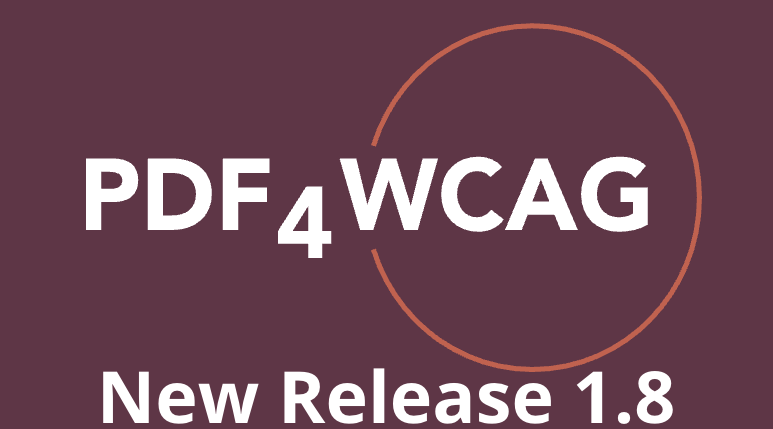
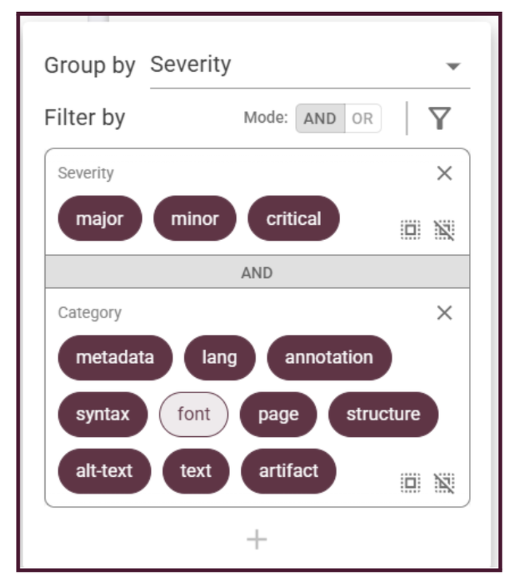
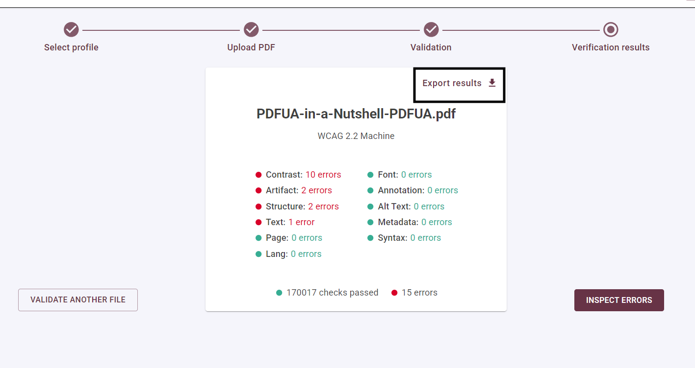
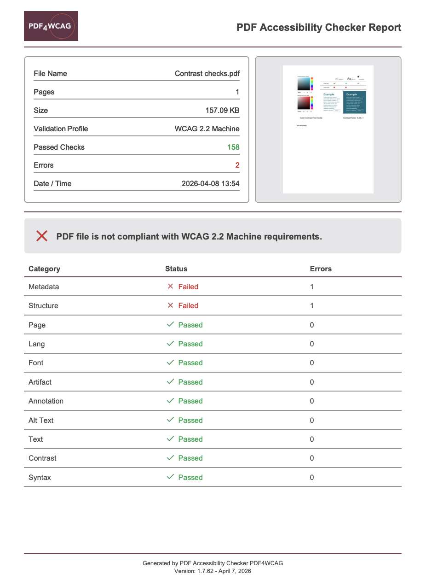

# New Release: PDF4WCAG 1.8 Accessibility Checker 

**Dual Lab** team is ready to announce a new update **1.8** to **PDF4WCAG**, delivering further improvements in validation accuracy, user experience, and overall stability.

## Improved accuracy

**Fixes in PDF/UA validation** to align with latest technical discussions within TWGs of PDF Association and veraPDF improvements:

* permit Math to be not necessarily an immediate child of Formula structure element;  
* improve glyph name calculation for **Type1** and **TrueType fonts**; 
* adjusted validation of the PDF Table structure element.

**Missing translations of error messages** have also been added to improve clarity across languages (Dutch, German, English).

## Enhanced user experience

**Error preview filters** have been reworked for more convenient error inspection. 

**Export validation results:** users can export validation results as PDF for client reporting, documentation or internal audits purposes. Just click on the **Export results** on the Summary page.

**One-click refresh:** users can reupload and repeat the analysis of the document in one click (Web) or just via Refresh button in the Desktop version. 

**GitHub and collaboration:** PDF4WCAG now includes a direct link to its GitHub repository within the feedback popup, inviting developers and users to contribute to the tool's roadmap.

**The ability to use PDF4WCAG command line** in the console (paid subscription).

**Commercial use of PDF4WCAG:** the commercial use of Desktop version and CLI automation is available in the annual subscription for just 299 EUR / 359 USD (excl. taxes). 

This release 1.8  reflects our ongoing commitment to providing precise, standards-aligned accessibility validation and a smoother user experience for organizations working toward **WCAG** and **PDF/UA** compliance.

## Roadmap update

We’re excited to announce the start of beta testing for the **PDF4WCAG** Integration API. If you’re interested in participating as a beta tester, please send us your request to [info@pdf4wcag.com](mailto:info@pdf4wcag.com).
