# PDF Trends 2026: Structure, Tagging, and Conformance of PDFs

[**Dual Lab**](https://pdf4wcag.com/company/) analyzed the complete June 2026 Common Crawl dataset (CC-MAIN-2026-25), comprising 20,578,394 PDF documents.

In the [**second part**](https://pdf4wcag.com/blog-news/analysis-pdf-file-size) of our PDF Trends analysis, we examined the evolution of the median PDF file size over the past 20 years. **In this third part,** we examine the semantic structure of Tagged PDF documents.

The analysis focuses on three issues:

1. How many PDFs contain a structure tree, and how large are those trees  
2. Which PDF structure elements are used most frequently  
3. How often do tagged PDFs conform to the structural requirements defined by PDF standards

These issues are extremely important because PDFs are used not only by human readers but also by assistive technologies, search systems, document-processing software, and AI applications.

## 1. Gradual growth in Tagged PDF adoption

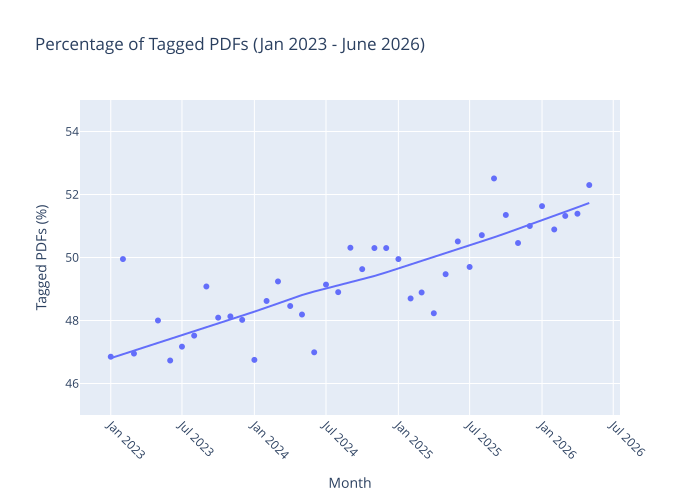

  Figure 1. Share of Tagged PDFs, January 2023–June 2026

In the time series analyzed by Dual Lab, the share of PDFs containing a structural tag tree increased by approximately 1.5 percentage points per year.

A significant milestone occurred in **July 2025**, when the share exceeded **50%**.

This indicates that, within the population measured by this time-series analysis, more than half of the PDFs included structural tagging by mid-2025. 

The trend shown on **Figure 1** indicates gradual adoption of Tagged PDF and greater availability of machine-readable document structures. However, with the current trend we’ll need to wait 10+ years before at least 70% of PDFs would be Tagged. 

However, the presence of Tagged PDFs does not guarantee that the structure is correct.

## 2. How many structure elements do PDFs contain?

The first measure is the distribution of the number of structure elements per document.

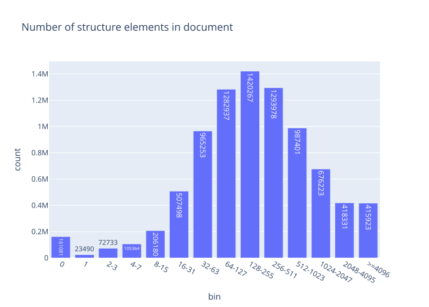

  Figure 2. Number of structure elements per document

The distribution peaks at 64–127 structure elements, indicating that PDFs with moderately sized structure trees are common in the analyzed dataset. The number of documents decreases toward both very small and very large structure trees.

**Figure 2** also shows that about 2% of the documents have an empty structure tree, which indicates that these documents are not correctly tagged. 

However, the number of structure elements alone should not be interpreted as a measure of accessibility or quality. A large structure tree can still contain incorrect relationships or invalid parent-child combinations.

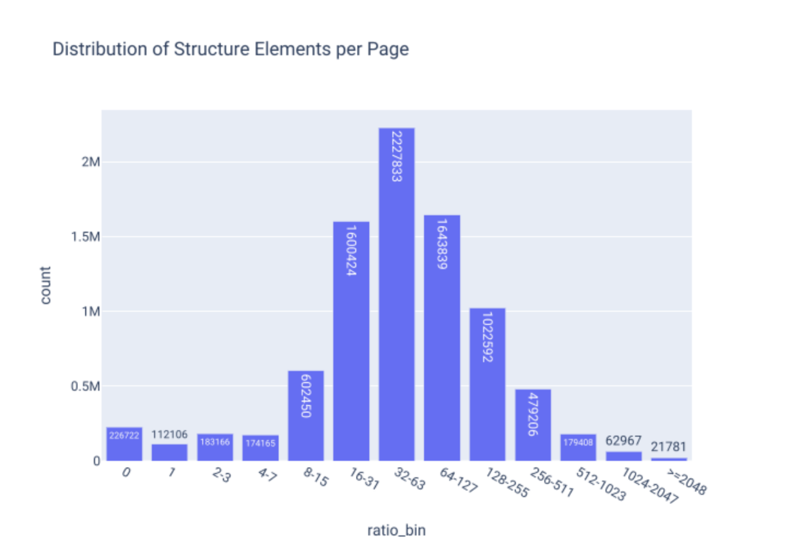

  Figure 3. Distribution of structure elements per page

As in case of file sizes (see Part 2), **Figure 3** illustrates that the number of structure elements has a log-normal distribution.

The distribution shows that pages most commonly contain **32–63** structure elements, followed by **64–127** and **16–31** elements. Pages with very large structured trees are much less common. This indicates that, at the page level, most Tagged PDFs use a moderate number of structural elements, while the distribution has a long tail toward larger structures. 

At the lower end we see the documents which most likely have a fictional Tagged structure: **161,081** documents contain no structure elements, while **23,490** contain one element and **72,733** contain 2–3 elements. It is very unlikely that such a small number of elements would correctly represent a content, which has at least several paragraphs of text.

This distribution shows that the presence of a PDF does not automatically imply the presence of a meaningful logical structure.

##  3. Structure tree depth

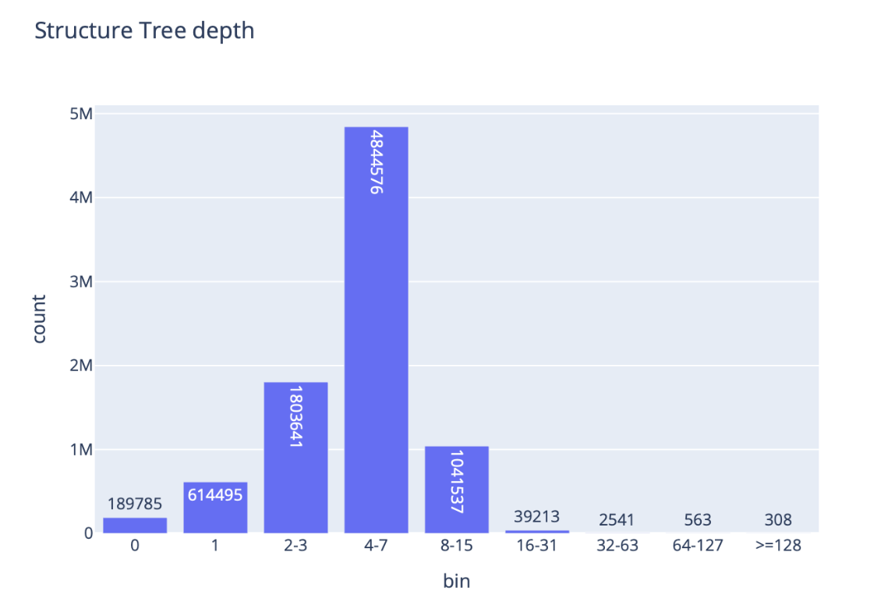

  Figure 4. Distribution of structure tree depth

Most structure trees have moderate nesting depth, which reflects a typical linear structure of the documents with occasional tables and lists. 

The largest group has the nesting depth of  **4–7 levels**, representing approximately **4.84** million trees. It is followed by **2–3 levels**, with approximately **1.80** million, and **8–15** levels, with approximately **1.04** million.

Very deep structures are rare and most likely indicate very special cases. Approximately **39,000** trees fall into the 16–31 range, only **2,541** have a depth of 32–63 levels, 563 have a depth of 64–127 levels, and 308 exceed 128 levels.

## 4. Accessibility conformance claims

The next analysis examines explicit conformance categories: **UA-only, A-only, and UA+A**.

Approximately 0.9% of documents are UA-only, 2.25% are A-only, and 0.07% report both UA and A conformance.

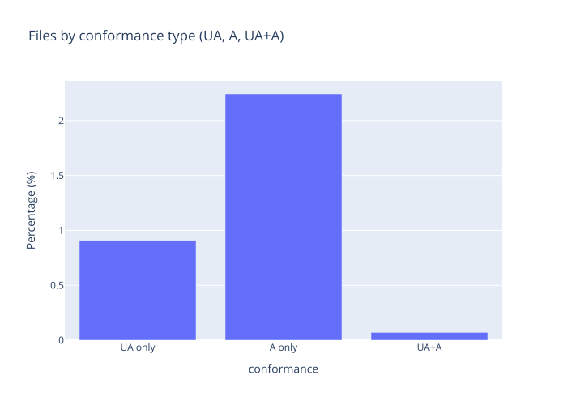

  Figure 5. Distribution of PDF Accessibility conformance claims

The distribution shows that explicit accessibility-conformance claims represent only a tiny proportion of the analyzed corpus. A-only claims are more common than UA-only claims, while documents reporting both UA and A conformance are comparatively rare. Yet, the fact that less than 1% of analysed PDFs contains PDF/UA conformance claim compared to about 50% of Tagged PDFs indicates that the many PDF producers started generating Tagged PDFs by default, but do not yet care about PDF/UA compliance. 

## 5. PDF/UA-1 and PDF/UA-2

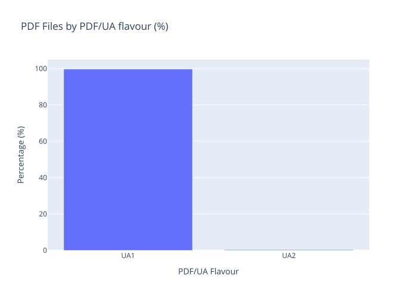

  Figure 6. PDF files by PDF/UA flavour

The analysis distinguishes between **PDF/UA-1** and **PDF/UA-2**.

PDF/UA-1 is defined by ISO 14289-1 for PDF 1.7, while PDF/UA-2 is defined by ISO 14289-2 for PDF 2.0.  

Approximately 99.3% of the identified PDF/UA files are PDF/UA-1, while approximately 0.3% are PDF/UA-2.

The figure shows a strong dominance of PDF/UA-1 and very limited adoption of PDF/UA-2 in the analyzed dataset.

### PDF/A conformance flavours

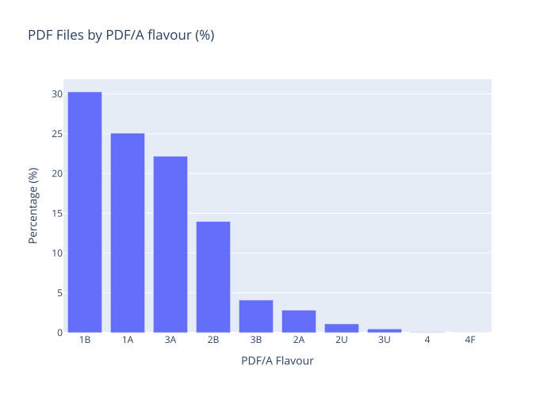

  Figure 7. PDF/A flavours

**Figure 7** shows the distribution of PDF/A conformance flavours in the analyzed dataset. PDF/A profiles are designed for long-term preservation and include different conformance levels and versions. The most common profiles in the dataset are PDF/A-1b, PDF/A-1a, PDF/A-3a, and PDF/A-2b.

## 6. Total occurrences of PDF structure element types. Which structure elements are least used?

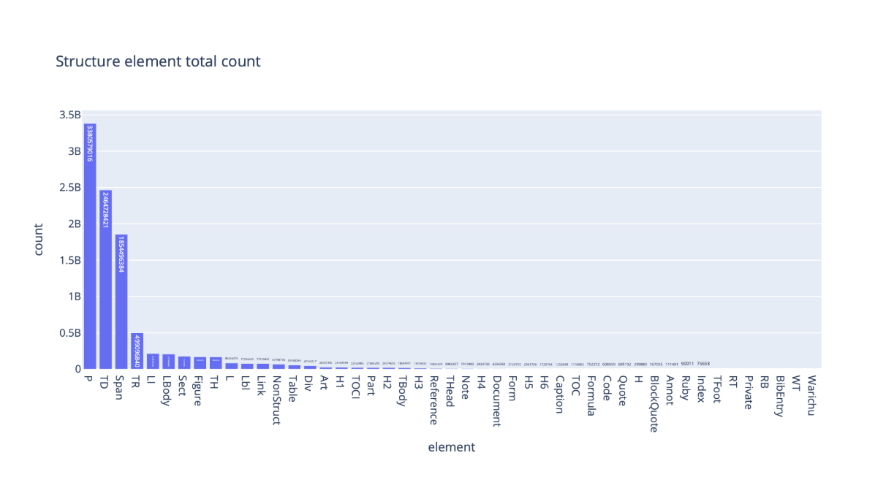

  Figure 8. Total occurrences of PDF structure element types

Across the analyzed corpus, the most frequently occurring structure element is **P** (paragraph), with approximately **3.38** billion instances.

It is followed by:

* **TD (table data cell):** approximately 2.46 billion  
* **Span:** approximately 1.85 billion  
* **TR:** approximately 0.50 billion  
* **LI:** approximately 0.21 billion  
* **LBody:** approximately 0.21 billion  
* **Sect:** approximately 0.18 billion

The distribution is strongly concentrated in a small set of core structure types.This indicates that real-world Tagged PDF documents rely heavily on a relatively small core vocabulary.

The use of specialized elements such as **Ruby**, **Warichu**, and **BibEntry** is almost negligible compared with the most common structure elements.

Zooming to the right side of **Figure 8**, here is a more detailed view on the least used structure elements.

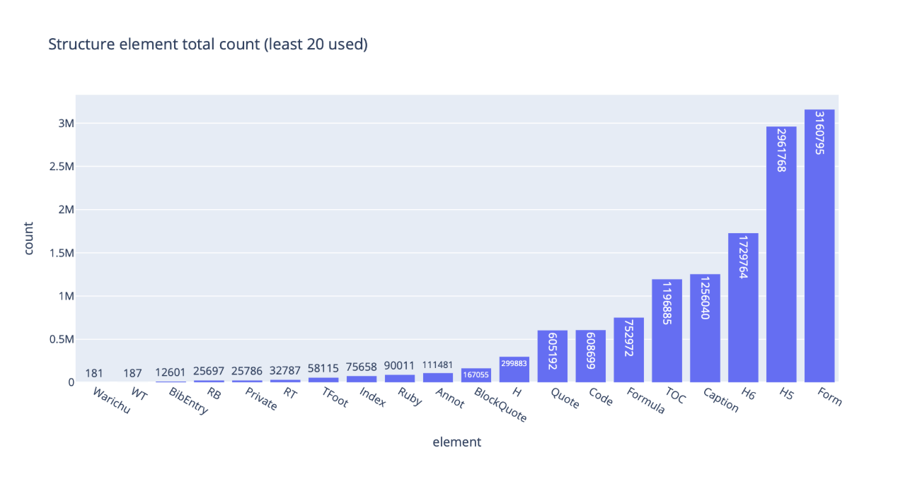

  Figure 9. 20 Less-Frequently Used PDF Structure Element Types

**Figure 9** shows 20 less-frequently used structure element types, ranging from Warichu and WT (181 occurrences each) to Form (3,160,795) and H5 (2,961,768).Other elements include BibEntry, Ruby, Index, Annot, BlockQuote, Formula, TOC, Caption, and H6.

The distribution is strongly concentrated among a small set of core structure types.

## 7. Custom Structure Tags

The analysis also identifies custom structure tags that are mapped to standard structure types. In PDF 2.0, namespaces provide a mechanism for defining additional or domain-specific tag sets.

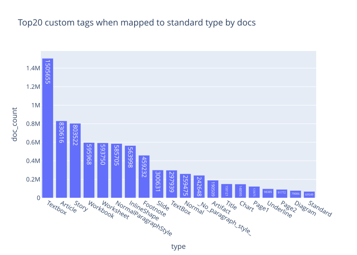

  Figure 10. Custom structure tags by number of documents

The most common custom tags include:

* **Textbox:** approximately 1.51 million documents  
* **Article:** approximately 831,000  
* **Story:** approximately 804,000  
* **Workbook**  
* **Worksheet**  
* **Footnote**  
* **Slide**  
* **NormalParagraphStyle**

The prevalence of names such as Textbox, Workbook, Worksheet, Slide, and NormalParagraphStyle is consistent with the influence of word-processing, spreadsheet, presentation, and other document-production software on PDF structure vocabulary.

The important observation is that custom naming does not necessarily indicate richer semantics.

In many cases, the names appear to reflect the terminology used by the producing application.

## 8. Top20 custom tags when not mapped standard type by docs

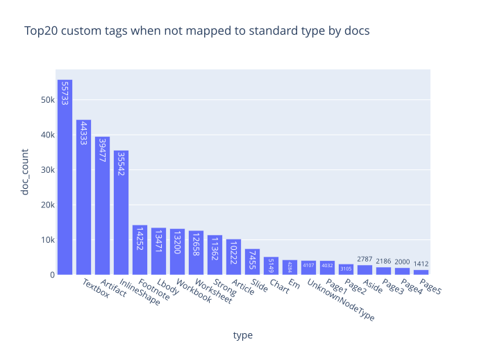

  Figure 11. Top20 custom tags when not mapped to standard type by docs

The distribution of custom tags shows how frequently PDF documents use non-standard structure types that are not mapped to recognized standard tags. Interestingly, the most common custom tag here is an empty one, which again indicates that something is wrong with the document tagging. 

Next most common is **TextBox**, appearing in 55,733 documents, followed by **Artifact** (44,333), **InlineShape** (39,477), and **Footnote** (35,542). Other frequently observed custom types include **Lbody** (14,311) - clearly a misprint in one of the implementations, **Workbook** (13,200), **Worksheet** (12,658), **Strong** (11,362), and **Article** (10,222).

These custom tags with no mapping to the standard PDF tags indicate that Tagged PDF structures are frequently generated using application or workflow specific semantics rather than being consistently mapped to standard PDF structure types.

## 9. ISO/TS 32005 Violations

ISO/TS 32005:2023 clarifies the rules governing the use of PDF 1.7 and PDF 2.0 structure namespaces in PDF 2.0 documents. The following analysis examines violations of the applicable hierarchical inclusion rules in the analyzed PDF population. The analysis includes only documents for which the ISO/TS 32005 rules are applicable.

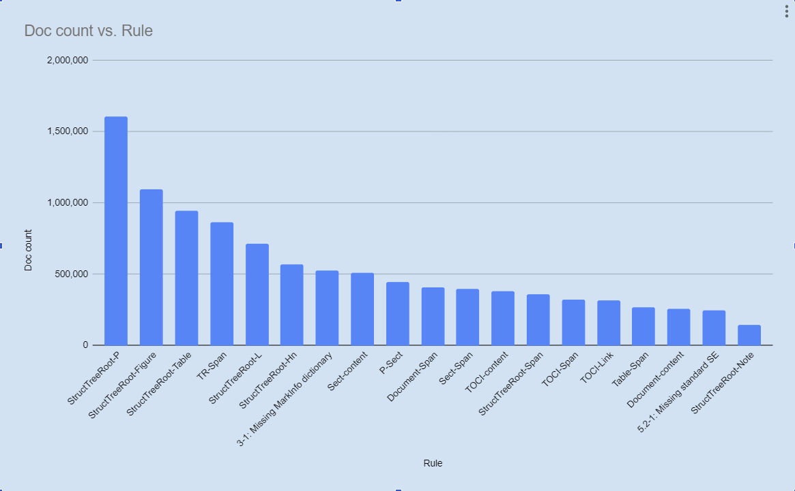

  Figure 12. Top 20 Failed Rules Under ISO/TS 32005 by Number of Documents

The most frequently affected rule is **StructTreeRoot-P**, affecting approximately **1.6** million documents. This failed rule means that the document has the P (paragraph) tag as a direct child of the Structure tree root, which is not permitted according to either ISO 32005 or PDF 1.7.

It is followed by:

* **StructTreeRoot-Figure:** approximately 1.1 million  
* **StructTreeRoot-Table:** approximately 0.95 million  
* **TR-SPan:** approximately 0.86 million

Other frequently failed rules affect hundreds of thousands of documents.

## Conclusions

The analysis of more than 20.5 million PDF documents shows increasing adoption of structural tagging, while the quality and validity of that structure remain inconsistent.

**The key findings are:**

* Structure trees are common but highly variable in size.  
* 64–127 structure elements is the most frequent range in the analyzed distribution.  
* A small core vocabulary accounts for most structure-element occurrences.  
* Most structure trees have moderate nesting depth.  
* The share of tagged PDFs has exceeded 50% in the analyzed time series since mid-2025 and continues growing by \~1.5% per year.  
* Explicit conformance claims remain uncommon. PDF/A is more common than PDF/UA. PDF/UA-1 remains far more prevalent than PDF/UA-2.  
* Millions of documents contain violations of ISO/TS 32005 schema.  
* Custom tags frequently reflect producer-specific naming conventions.

**Tagging a PDF** is not the same as creating a well-structured PDF.

The presence of a structure tree is an important foundation, but it is only the beginning. For accessibility, reuse, automated processing, and AI, the structure must also be meaningful, correctly organized, and conformant with the applicable standards.

As PDF documents increasingly become inputs for machines as well as humans, structure quality will become as important as visual quality.

