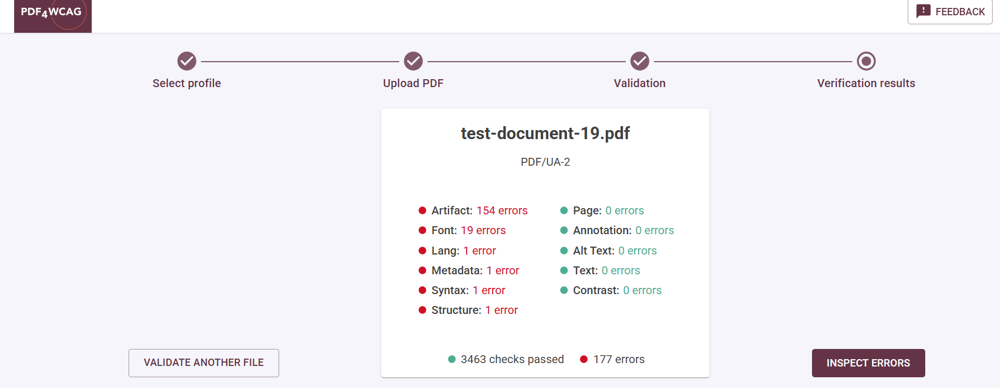
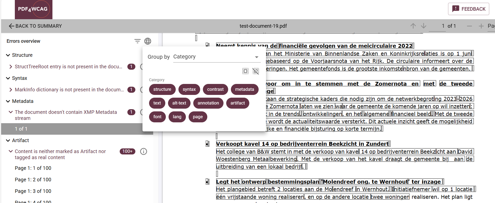

# PDF4WCAG for PDF 2.0

PDF 2.0 is the first core PDF standard developed entirely under ISO guidelines & processes. The standard for PDF 2.0 was published in 2020 as ISO 32000-2:2020, and the industry adoption is starting to grow. PDF 2.0 (ISO 32000-2:2020) is an open, international standard designed to work across platforms and vendors.

## Highlights

- **Backwards compatible:** aligned with common implementations & current user expectations for PDF 1.7
- **Rewritten Tagged PDF and Accessibility** PDF 2.0 includes significant enhancements for accessibility through a tagging structure, support for more complex content
- **Feature rich for all users & all use cases:** it is accompanied with updated subset standards such as PDF/A-4 (Archival) and PDF/UA-2 (Universal Accessibility) PDF can prohibit, restrict, constrain, the core PDF 2.0 requirements
- **Associated files:** allowing other files to be attached in appropriate structures within a document, e.g. for computer-readable copies or alternative representations of the same content
- **MathML support:** formal definition of inclusion of MathML into PDF structure tree, which is a crucial improvement for scientific publications

## Tagged PDF in PDF 2.0

In PDF 2.0, Tagged PDF is improved by fewer tags, better descriptions of tags, clear indication where they can/cannot be used and more flexible (restrictions exist only where necessary). Additional 
Technical Specification [ISO/TS 32005:2023](https://pdfa.org/resource/iso-32005/) defines inclusion of PDF 1.7 structure elements into PDF 2.0.

## Accessibility of PDF 2.0 is governed by PDF/UA-2 standard published in 2024

It's important to remember that accessibility of PDF 2.0 documents is governed by the [**PDF/UA-2**](https://pdfa.org/iso-14289-2-pdf-ua-2-the-gold-standard-for-accessibility-in-pdf-2-0-has-arrived/) standard, which was published in March 2024. This ISO standard is the successor to PDF/UA-1 and was created to address the shortcomings of the older standard by building upon the modern PDF 2.0 specification, providing more explicit requirements. 

## LaTeX Project has implemented PDF/UA-2 support for scientific publications including correct tagging of mathematical formula 

[**LaTeX Project**](https://www.latex-project.org/) plays a significant role in implementing **PDF/UA-2** support for scientific publications, including accurate tagging of mathematical formulas — a critical step toward making complex STEM documents truly accessible. The core message: PDF/UA-1 simply isn’t designed for mathematics, so marking documents as “compliant” doesn’t mean they’re actually usable by people with disabilities. PDF/UA-2, on the other hand, handles math properly through MathML support — it’s the standard that actually works for STEM. 

It's clear that the universities require all course materials to comply with accessibility standards, ensuring equal access for all learners. PDF/UA-2 is new, so tools and workflows are still catching up. 

## veraPDF has released the support for PDF/UA-2 validation (machine verifiable rules)

VeraPDF has added support for PDF/UA-2 validation, allowing users to validate documents against the machine-verifiable rules of the new standard, which builds on PDF/UA-1. This validation is implemented through formal rules defined in XML documents called validation profiles, which are used at runtime by the [veraPDF](https://docs.verapdf.org/validation/) engine to check compliance. 

## PDF4WCAG wraps veraPDF into a nice web interface with error preview and is free for non-commercial use

PDF4WCAG is PDF Accessibility checker that implements PDF validation against various requirements including PDF 2.0.  Its free web-based demo simplifies PDF accessibility testing.

It is powered by the veraPDF validation architecture and is identical to veraPDF in machine verifiable checks of PDF/UA-1, PDF/UA-2 and Well-Tagged PDF profiles. It leverages the veraPDF validator to provide clear, visual reports, making it easy for anyone to identify and resolve compliance issues without technical expertise. Free Non-Commercial Access: making professional validation tools available to all.

## To sum it up

- **PDF/UA-2** fixes long-standing accessibility gaps — especially for math
- **LaTeX** now supports accessible math via **MathML**, enabling true STEM accessibility
- **veraPDF** provides official machine-verifiable validation for PDF/UA-2
- **PDF4WCAG** makes these validations visual, simple, and accessible to everyone

## WCAG validation for PDF 2.0 documents

When performing WCAG validation PDF4WCAG differentiates between PDF 2.0 and PDF 1.7 (or earlier) versions of PDF. The validation of PDF 2.0 documents is based on a newer PDF/UA-2 substandard, while all earlier versions of PDF 1.7 use PDF/UA-1 as a basis. See [What is WCAG for PDF](/blog-news/what-is-wcag-for-pdf) for more details how WCAG validation is related to PDF/UA requirements.  
