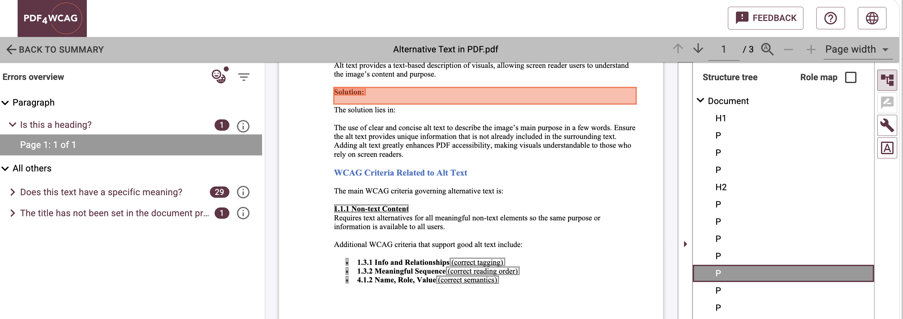
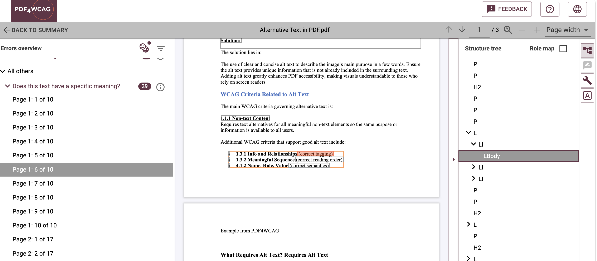
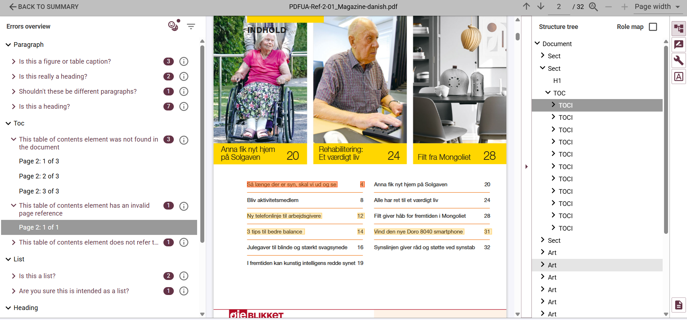
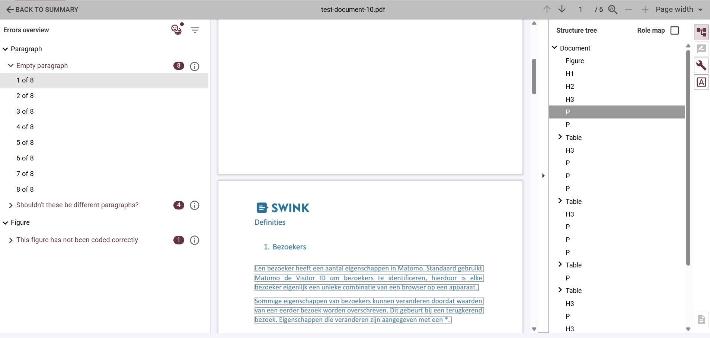
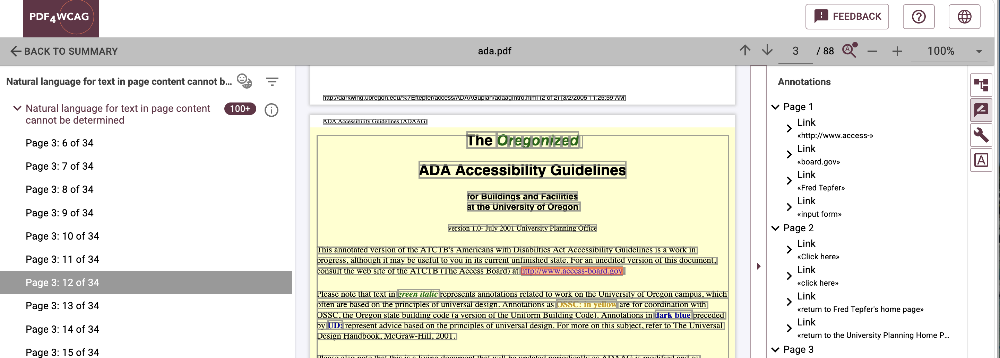
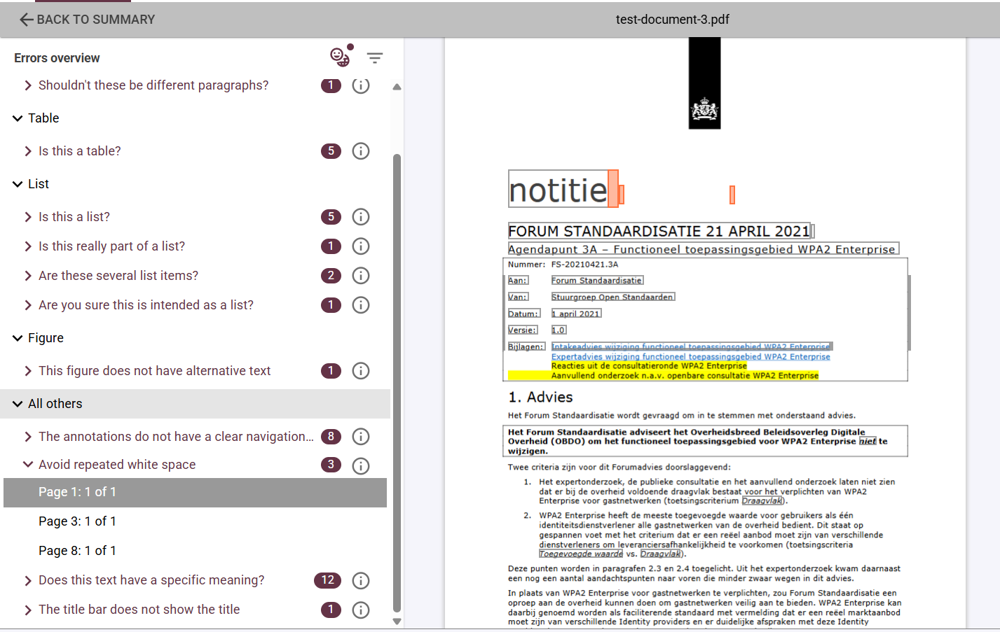

# PDF4WCAG Human Checks: what is covered?

Automated PDF accessibility validation can check many technical requirements, but some accessibility questions require a different type of analysis: does the existing PDF structure actually match what a user sees and understands in the document?

PDF accessibility cannot always be evaluated by checking whether the required tags are present. A PDF may contain a Structure Tree, but the tags can still be inappropriate for the content they represent.

The WCAG 2.2 Human profile in **PDF4WCAG** adds checks that look at the relationship between the visual presentation of a PDF and its existing semantic structure. PDF4WCAG performs Document Layout Analysis independently of the existing Structure Tree and then compares the results. This approach is used for what PDF4WCAG calls semantic validation. 

## Semantic validation of existing structure tree

A Structure Tree describes the semantic structure of a tagged PDF. However, tags can be present but used incorrectly.

For example:

* a heading can be tagged as <code>\<P\></code>;  
* a paragraph can be tagged as <code>\<H\></code> or <code>\<H1\></code>;

**PDF4WCAG** performs layout analysis and compares the detected content type with the structure element in the PDF. This makes it possible to identify potential semantic mismatches, such as a heading incorrectly tagged as a paragraph or a paragraph incorrectly tagged as a heading. 

The Human profile includes checks for <code>\<P\></code>, <code>\<Span\></code>, headings, lists, tables, captions, and other structural elements. 

The important point is that the existence of a Structure Tree does not by itself prove that the structure is semantically correct.

### Missing inline semantics

Semantic information can also exist inside a paragraph or another text element.

For example, a document may use:

* underlined text;  
* highlighted text;  
* a different font;  
* a different font style;  
* a different color.

These visual differences can indicate additional meaning. If that meaning is not represented in the Structure Tree, the semantic information may not be available in the same way as assistive technologies.

**PDF4WCAG** checks for underlined text outside the link context and for text with a visually different presentation that may require an appropriate inline semantic element such as Span. 

## Table of Contents correctness

A Table of Contents has both visual and navigational information. It is therefore not enough to check that the TOC looks correct. **PDF4WCAG** Human Checks examine whether TOC items correspond correctly to the document and their navigation destinations.

The checks include:

* TOC item text that cannot be found in the document;  
* TOC item text that is not found on the destination page;  
* missing interactive links;  
* incorrect page numbers;  
* inconsistent TOC numbering;  
* TOC items pointing to the wrong page. 

## Empty structure elements

**PDF4WCAG** also detects empty structure elements that may not provide useful content. The Human validation profile includes checks for empty structural elements such as:

* \<Title\>
* \<P\>
* \<H\>
* \<H1\>–\<H6\>
* \<Span\>
* \<TOCI\>

Empty paragraphs, headings, and TOC items can create unnecessary structure and may affect how content is interpreted by assistive technologies. PDF4WCAG also documents non-empty structure checks as part of its WCAG validation. 

## Meaningful descriptions for links

[A link should give users enough information to understand its purpose.](https://www.w3.org/TR/WCAG22/#link-purpose-in-context) For example, a link labelled **“Click here”** provides little information when a user navigates through links without the surrounding visual context. PDF4WCAG checks link descriptions against the WCAG requirement for link purpose and looks for meaningful, descriptive link text rather than generic descriptions. 

## Repeated spaces used for formatting

Another Human Check looks for repeated space characters used to create visual formatting. Multiple spaces may create visual alignment on the page, but spaces do not provide a semantic relationship between the labels and their values.

This is an example of the difference between visual presentation and document structure. What looks aligned to a person may not have an equivalent semantic representation in the PDF.

## Human checks are heuristic-based, not a replacement for human review

**PDF4WCAG** describes the WCAG 2.2 Machine & Human profile as an experimental heuristic implementation of human checks.  The purpose is to identify potential problems that can benefit from human attention. The layout analysis does not turn a visual interpretation into an automatic accessibility decision.

**Instead, it provides another layer of evidence:**

**Machine validation -** checks formal, algorithmic requirements

**Document layout analysis -** analyzes the visual organization independently

**Comparison with structure tree -** identifies potential semantic inconsistencies

**Human review -** evaluates the result in context

## Conclusion 

The PDF4WCAG **WCAG 2.2 Human** profile currently covers several areas where the relationship between visual presentation and semantic structure is important:

* Semantic appropriateness of existing tags  
* Missing inline semantics  
* Table of Contents correctness  
* Empty structure elements  
* Meaningful link descriptions  
* Repeated spaces used for formatting

Together, these checks add another layer to PDF accessibility validation: machine-verifiable rules check the technical structure, while the layout analysis helps examine whether that structure corresponds to the document as it is visually presented.
