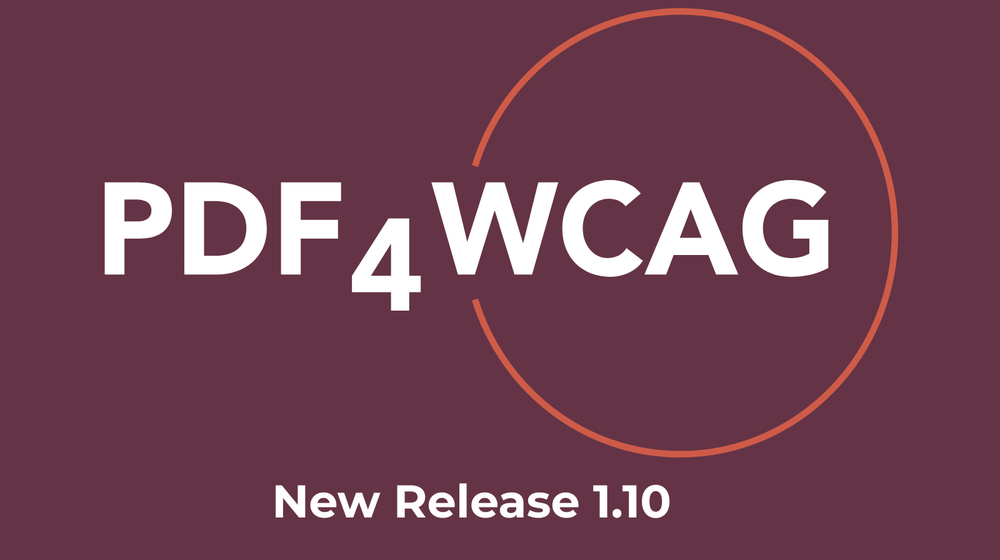

# Dual Lab releases PDF4WCAG Accessibility Checker 1.10

Dual Lab announces the release of **PDF4WCAG Accessibility Checker 1.10**, introducing usability enhancements, expanded localization support, and new document inspection panels.

**PDF4WCAG** is a professional accessibility validation solution for PDF documents, designed to support compliance with PDF/UA, WCAG, and WTPDF accessibility requirements. It is powered by the [**veraPDF**](https://verapdf.org/) validation architecture and is identical to **veraPDF** in Machine verifiable checks of **PDF/UA and WTPDF validation profiles**.

## What’s new in Version 1.10

<h3 style="text-align: left">Enhanced localization and user experience</h3>

**PDF4WCAG**  1.10 improves interface usability and multilingual support:

- Redesigned switching between **technical terminology** and **user-friendly language**, providing a more intuitive experience for both accessibility experts (developers) and non-technical users.  
- Added support for **German** and **Dutch** interface localizations.

<h3 style="text-align: left">Improved zoom and navigation controls</h3>

Accessibility issue navigation has been refined for better usability:

- Enhanced zoom behavior for small issue regions and error highlights.

<h3 style="text-align: left">New inspection panels</h3>

**PDF4WCAG 1.10** introduces several new analysis panels to provide deeper document insights:

**Annotations panel**

Inspects PDF annotations, comments, hyperlinks, form controls, and other interactive elements relevant to accessibility and usability evaluation.

**Metadata panel**

Displays document metadata including:

- document title  
- author information  
- document language  
- accessibility properties  
- PDF/UA-related metadata entries

**Fonts panel**

Provides detailed analysis of:

- embedded fonts  
- font types and subsets  
- encoding information

<h3 style="text-align: left">Persistent user preferences</h3> 

**PDF4WCAG** now preserves user configuration settings between sessions, improving workflow continuity and efficiency. Persisted settings include:

- selected interface language  
- active filters  
- right-side panel state and opened sections  
- structure tree role map visibility  
- auto-scaling preferences

<h3 style="text-align: left">CLI enhancements</h3>

The command-line interface has been extended with initial support for additional validation profiles:

- **WCAG Machine**  
- **WCAG Machine & Human**

These profiles are now available under paid commercial licenses on the [PDF4WCAG website](https://pdf4wcag.com/licensing/).

<h3 style="text-align: left">Public API documentation</h3>

A new public documentation section is now [available](https://pdf4wcag.com/documentation/local-deployment). API is available  under paid commercial licenses on the [PDF4WCAG website](https://pdf4wcag.com/licensing/).

<h3 style="text-align: left">Integration API Beta testing</h3>

The **PDF4WCAG Integration API** is in the process of  beta testing. The API is designed to simplify integration of accessibility validation workflows into enterprise systems, document processing pipelines, and third-party accessibility platforms. 

## About Dual Lab

Founded in 2008, Dual Lab specializes in science- and technology-intensive software development across multiple domains including PDF Technologies, complex Document Management workflows, 3D Modelling, Fintech and others. Dual lab is a partner member of PDF Association.

For more information, visit the [website](https://duallab.com/).
