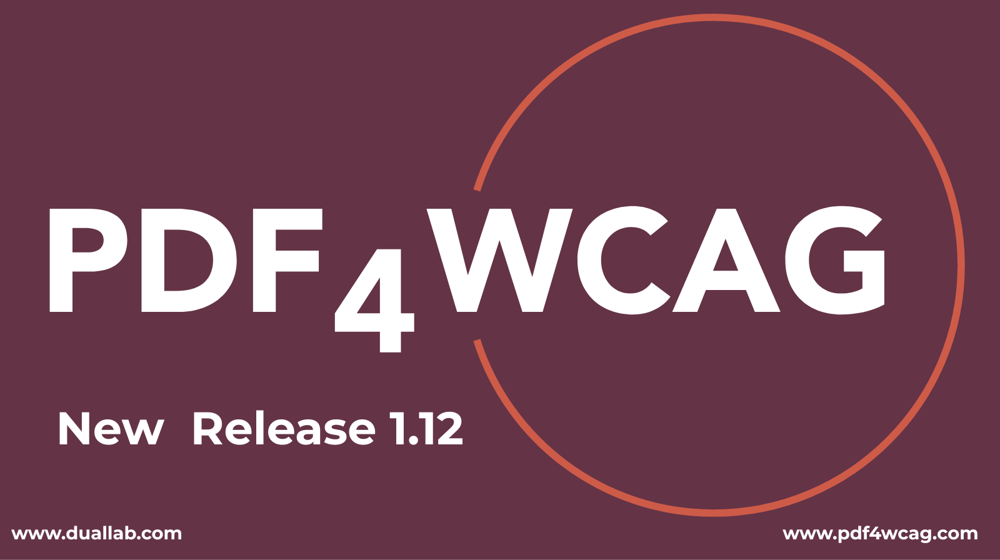

# Dual Lab releases PDF4WCAG Accessibility Checker 1.12

[**Dual Lab**](https://pdf4wcag.com/company/) announces the release of [**PDF4WCAG Accessibility Checker 1.12**](https://pdf4wcag.com/). The release introduces ***improvements to accessibility and keyboard navigation, error visualization, validation accuracy, localization to Korean language and application stability.***

**PDF4WCAG Accessibility Checker** is designed to help organizations evaluate PDF documents against **PDF/UA, WCAG, and WTPDF accessibility requirements**. The solution is powered by the [**veraPDF**](https://pdf4wcag.com/company/) validation architecture and provides machine-verifiable checks based on the PDF/UA and WTPDF validation profiles.

## What’s new in PDF4WCAG 1.12

## Improved accessibility and user experience

**Version 1.12** improves the **PDF4WCAG** interface and makes the application easier to navigate and use.  

**Key improvements include:**

* Enhanced **accessibility and keyboard navigation**. 

## Better error visualization

**PDF4WCAG 1.12** improves the way validation errors are presented and connected to the relevant elements in a PDF.

**The release includes:**

* Improved handling of **annotation-related errors**, including missing highlights and corresponding properties in the **annotation** panel.   
* Support for displaying **metadata errors**.   
* Improved highlighting of **errors related to missing language identification**. 

## Validation improvements

The new release includes several updates designed to improve the accuracy and consistency of validation results.

**Version 1.12:**

* Fixes reporting for **ISO 14289-2:2024 8.2.5.20 (Link annotations targeting different locations)**  
* Fixed LaTeX specific errors in human checks.  
* Removes selected WCAG rules that are no longer applicable to the validation workflow. 

**These changes help provide more precise and actionable validation results for PDF accessibility professionals.**

## Localization updates

**PDF4WCAG 1.12** expands localization with the addition of the **Korean language**.

**The release includes:**

* Korean interface translations.   
* Korean translations for validation error messages.  
* Support of CJK fonts in PDF reports.    
* Translated documentation. 

The localization updates make PDF accessibility testing more accessible to Korean-speaking users and organizations.

**Application improvements**

**Additional application improvements include:**

* Improved **veraPDF log and warning reporting** to users.   
* Updated and clarified error messages.   
* Improvements to the **verapdf-js-viewer** documentation.   
* Improved session management. 

## Supporting PDF accessibility and compliance

The combination of **machine-verifiable validation, detailed error reporting, and an interactive interface** helps accessibility teams, developers, document creators, and compliance professionals identify and address PDF accessibility problems more efficiently.

**PDF4WCAG 1.12** continues **Dual Lab’s** focus on making PDF accessibility validation more accurate, transparent, and practical for organizations working toward PDF/UA, WCAG, and WTPDF compliance.

**Contact us:** 

[info@duallab.com](mailto:info@duallab.com)  
[info@pdf4wcag.com](mailto:info@pdf4wcag.com)
