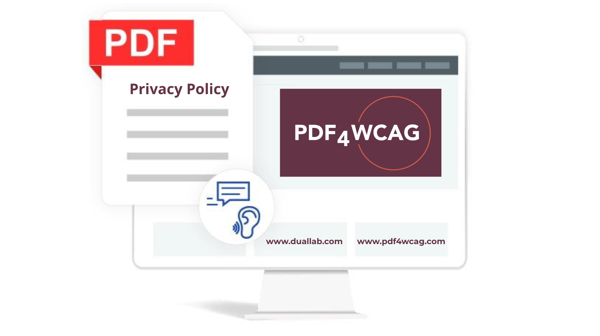

# Privacy Policy differences between the Web and Desktop versions of PDF4WCAG

**TL;DR:** This article explains the **Privacy Policy of PDF4WCAG**. How **PDF4WCAG** collects, uses, and protects information when a user performs the validation on the website or works with the Desktop version. 

Organizations that process PDF documents often face strict requirements for data privacy, confidentiality, and regulatory compliance. To meet different operational needs, **PDF4WCAG** is available in both Web and Desktop versions giving users the opportunity to choose the deployment that best fits security and workflow requirements.

## Privacy is a major concern 

PDF accessibility validation  involves sensitive content, including corporate reports, legal documents, financial statements, educational materials and government publications. Before selecting PDF accessibility checker, organizations should understand where **their documents are processed and what information may be transmitted outside their environment.**

## PDF4WCAG Web version and privacy policy

The Web version of **PDF4WCAG** is designed for convenience and accessibility. Users can access the service through a [web browser](https://pdf4wcag.com/validate/new-job/settings) without installing any software. Users access Web versions instantly, regardless of their operating system, making onboarding fast and effortless. Automatic updates mean there is no need to manage versions or worry about outdated functionality.

<h3 style="text-align: left">Document processing in the Web version</h3>

Files are saved in the browser and then sent to the **PDF4WCAG server, where they are deleted immediately after the end of the session. PDF4WCAG doesn’t send files anywhere else.** PDF4WCAG uses files just for analysis in case of problems when a user requests. 

Web version integrates with **veraPDF** validation engine. **PDF4WCAG** doesn’t store its own cookies in the browser. However, it does utilize Google Analytics and collects cookies required by the Google Agent itself. **PDF4WCAG** also stores basic application settings in the browser (language, selected profile, document zoom, and whether to open the right-hand panel by default).

<h3 style="text-align: left">Use cases of web version</h3>

* Individual accessibility specialists.  
* Small and medium-sized organizations.  
* Small PDF remediation projects.  
* Remote teams requiring browser-based access.

## PDF4WCAG Desktop version and privacy policy

**PDF4WCAG** provides **Desktop version** for all major platforms, offering an identical user experience across operating systems (Windows, Linux, macOS). PDF4WCAG Desktop transfers the functionality of the web-based **PDF4WCAG Accessibility Checker** into a local environment keeping the same visual experience. It represents a desktop wrapper for the web application, enabling users to perform PDF accessibility validation directly on their computers without relying on an internet connection. 

<h3 style="text-align: left">Document processing in Desktop version</h3>

**Desktop version of PDF4WCAG operates offline.** **It does not send or collect any data to the Internet or outside.** As Web version, the desktop version also integrates with veraPDF validation engine, providing the same error previews, compliance reports, and interactive issue visualization as the online tool. 

This approach reduces exposure to third-party infrastructure and supports environments with strict confidentiality requirements.

<h3 style="text-align: left">Use cases of Desktop version</h3>

* Government agencies.  
* Financial institutions.  
* Healthcare organizations.  
* Legal firms.  
* Enterprises handling confidential or regulated information.

## Comparing the two versions

<h3 style="text-align: left">🌐 Web Version</h3>

  * **Installation required**: No  
  * **Browser access**: Yes  
  * **Document storage location**: PDF4WCAG server  
  * **Local processing**: No  
  * **Sensitive docs**: Depends on policies  
  * **Files auto-delete after session**: Yes  

<h3 style="text-align: left">💻 Desktop Version</h3>

  * **Installation required**: Yes  
  * **Browser access**: No  
  * **Document storage location**: Local directory  
  * **Local processing**: Yes  
  * **Sensitive docs**: Highly suitable
  * **Files auto-delete after session**: Yes  

## Conclusion

Both **PDF4WCAG Web** and **Desktop editions** deliver powerful PDF accessibility capabilities. The key difference lies in where document processing takes place. Organizations handling confidential, proprietary, or regulated information may prefer the Desktop version for its local-processing architecture, while users seeking flexibility and ease of deployment may find the Web version the more practical choice.

Understanding these privacy distinctions helps organizations select the deployment model that best aligns with their security, compliance, and operational requirements.

***Contact us:***

**email**: info@pdf4wcag.com
