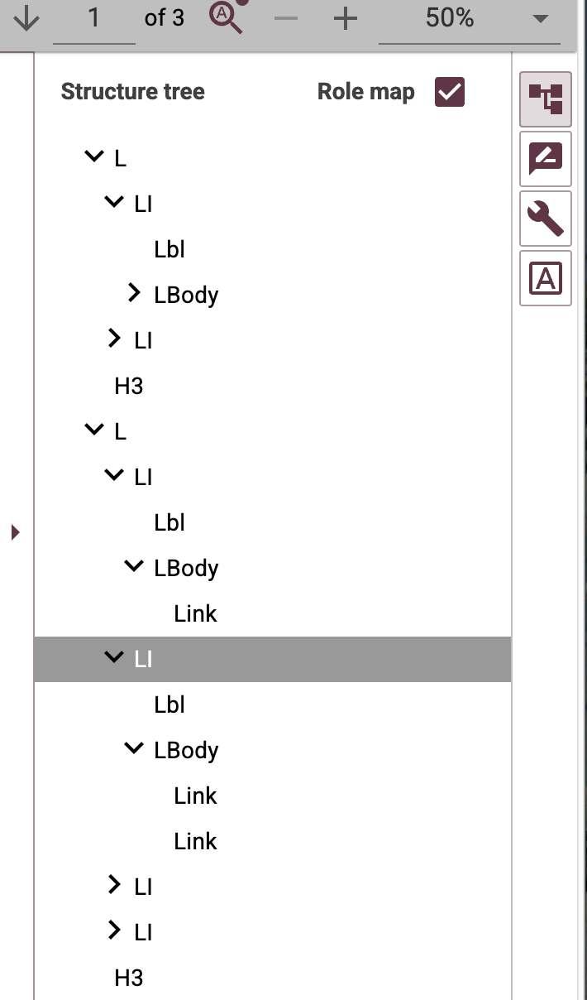
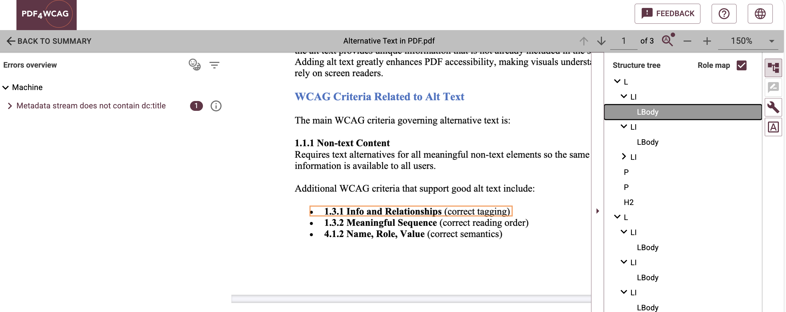
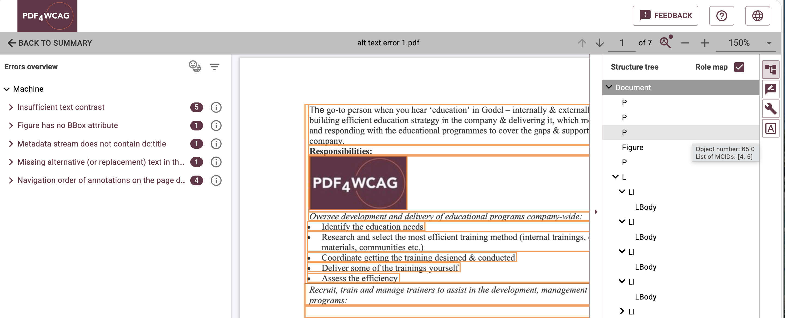

# Structure Tree in PDF4WCAG 

## What is a Structure Tree?

**The Structure Tree** represents the logical structure of a tagged PDF document. It consists of structure elements such as headings, paragraphs, lists, tables, and figures, organized in a hierarchical tree that is interpreted by assistive technologies. It also defines the reading order of the document content.

Accessibility validation is performed against these logical structure elements rather than the document's visual appearance, making the **Structure Tree** an essential component of PDF accessibility analysis.

The **Structure Tree** defines how assistive technologies interpret and navigate a tagged PDF. In **PDF4WCAG Accessibility Checker**, users can inspect this hierarchy to verify that headings, paragraphs, lists, and other structure elements are organized correctly and follow a logical reading order.

## Accessibility Checker and the Structure Tree

Accessibility checkers can detect an **empty paragraph (`
`)**, but without a Structure Tree it is often impossible to determine which paragraph caused the error. Unlike many visual accessibility issues, an empty structure element usually has no visible representation on the page and therefore cannot be highlighted in the document view. As a result, users are often left searching through the document to locate the offending element.

**PDF4WCAG Accessibility Checker 1.10** addresses this problem by introducing an interactive **Structure Tree**. When a validation error is selected, the corresponding structural element is highlighted in the Structure Tree panel, allowing users to quickly locate the issue within the document hierarchy. An empty paragraph is just one example; the same approach can be used to investigate other structural accessibility problems.

So, when an empty paragraph is detected, users can navigate directly to the corresponding **`
`** structure element in the tree. This makes it immediately clear where the error occurs and allows users to inspect the element's parent and child nodes, understand its context within the document hierarchy, and resolve the issue more efficiently.

## Structure Tree and Roadmap Navigation

**PDF4WCAG Accessibility Checker 1.10** also enhances navigation through both the **Structure Tree** and the **Roadmap**.

The **Structure Tree** provides a hierarchical view of the document's logical organization, while the Roadmap presents the logical reading sequence of the document. Together, these complementary views help users understand both the document hierarchy and its reading order, making it easier to investigate and remediate accessibility issues in complex PDF documents.

## Conclusion

The Structure Tree is one of the most valuable tools for PDF accessibility remediation. While validation reports identify what is wrong, the Structure Tree shows where the problem exists within the document's logical structure.

By combining synchronized navigation between the validation results, Structure Tree, Roadmap, and document view, **PDF4WCAG Accessibility Checker 1.10** enables accessibility specialists to locate and understand structural issues such as empty paragraphs much more quickly than with traditional validation reports alone. For large and complex tagged PDFs, this significantly reduces remediation time and improves the efficiency and accuracy of accessibility corrections.
