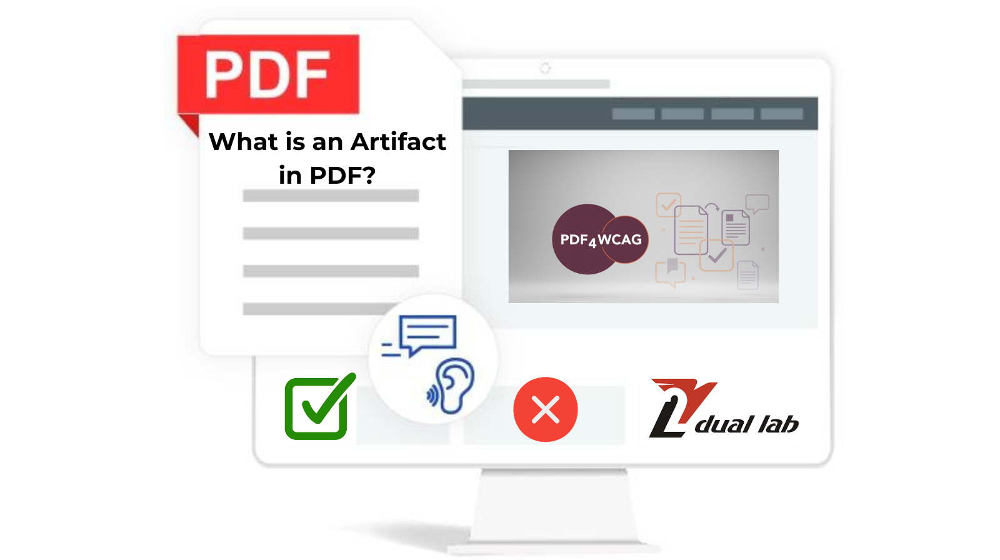
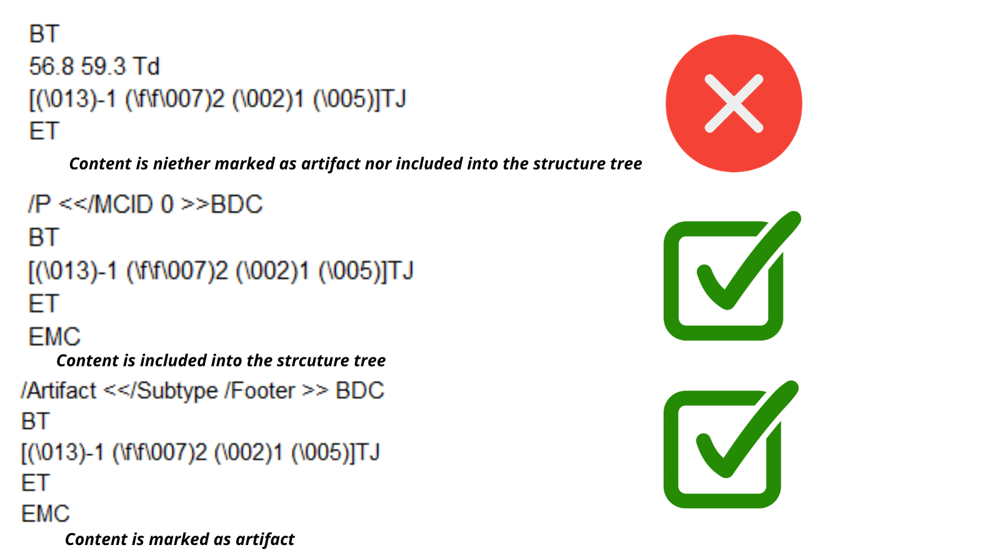
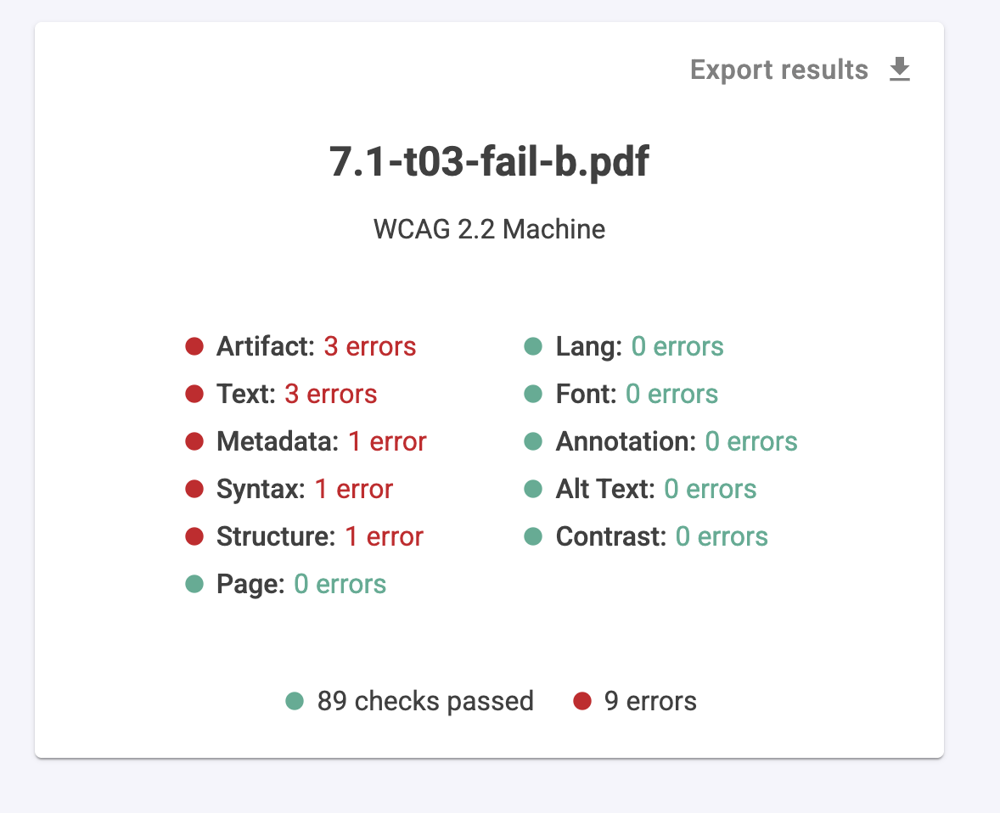
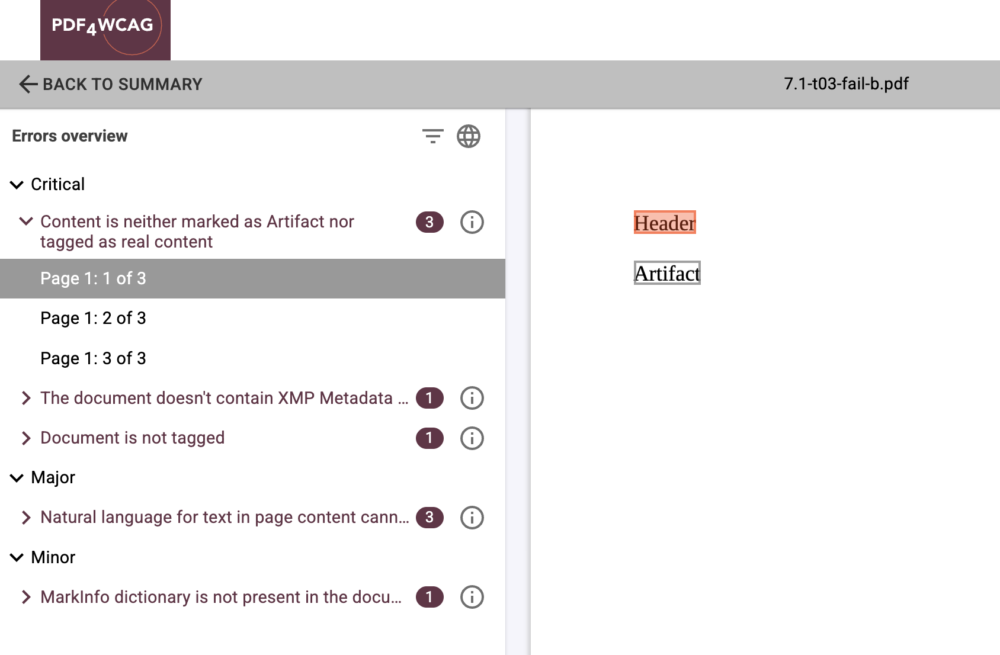

# What is an Artifact in PDF?

**PDF artifacts** are non-semantic visual elements introduced during document generation, rendering, scanning, or OCR processing. In AI pipelines, these artifacts reduce extraction quality and negatively impact downstream tasks such as embeddings, retrieval, and LLM reasoning.

## Typical PDF artifacts include: 

- page header/footer  
- table headers for multi-page tables  
- decorative elements interpreted as content  

***Artifacts should generally be ignored by assistive technologies such as: screen readers, text-to-speech systems, accessibility APIs, AI semantic extraction pipelines.***

This concept is very similar to decorative elements in HTML accessibility.

For example, in HTML: decorative images use alt="",  layout containers may use ARIA presentation roles, CSS-generated visuals are ignored semantically.  In PDFs, the equivalent mechanism is marking content as an **Artifact.**

By the way **artifacts play a critical role in PDF/UA compliance and screen reader usability.** Without proper artifact handling, assistive technologies may read decorative or repetitive content aloud, creating confusion and misunderstandings for users.

Modern accessibility validation tools such as **PDF4WCAG Accessibility Checker** help identify these issues and ensure PDFs correctly distinguish meaningful content from decorative elements.

**The core requirement of both PDF/UA and WCAG** is that every piece of content must be designated either as an artifact or as part of the structure tree nothing can be left. This is exactly what PDF4WCAG verifies.

## Sample of Artifact errors after PDF4WCAG validation

## PDF 2.0 and richer artifact semantics

PDF 2.0 (ISO 32000-2:2020) brought significant improvements to the handling and definition of artifacts compared to previous versions. 

Key improvements to the Artifact model in PDF 2.0 include:

* Standardized Tagging: PDF 2.0 provides clearer, more robust mechanisms for marking items as artifacts, especially in tagged PDF, reducing ambiguity for accessibility tools.  
* Reduced Vague Wording: It addresses ambiguities in earlier PDF 1.7 specifications, providing clearer rules for how developers and software should handle artifacts.  
* Better Annotation Handling: Annotations and their relation to structural elements are better defined, reducing issues where background decorations or marginalia are misidentified as content.  
* Improved Structural Hierarchy: It clarifies how artifacted content can interact with the document structure tree, particularly regarding how tags should be ordered or ignored, which was a point of ambiguity in older standards. 

***To sum it up, proper use of artifacts is one of the foundational concepts of PDF accessibility.***  
***A well-structured accessible PDF must clearly separate: meaningful semantic content and decorative or auxiliary presentation elements.*** 

As PDF accessibility evolves, especially with PDF 2.0 semantics and AI-driven document processing, artifact classification becomes increasingly important not only for accessibility specialists, but also for developers, publishers, and AI engineers building intelligent document systems.  
