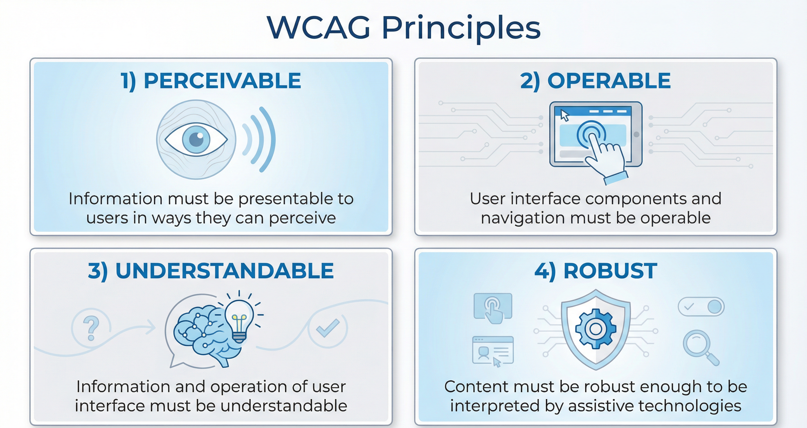
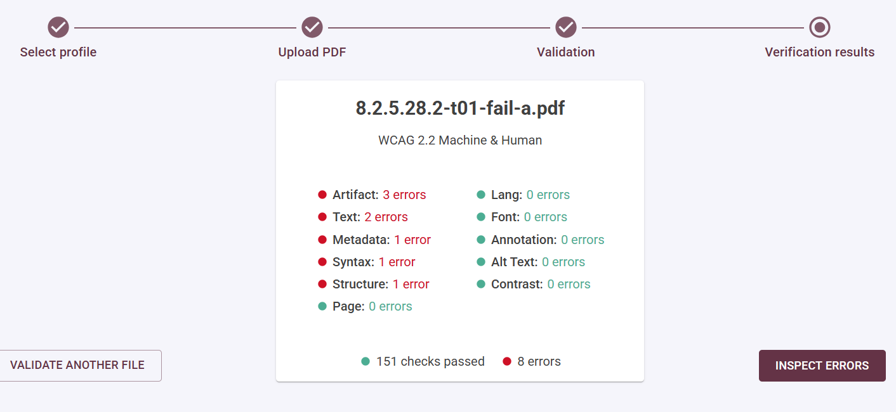
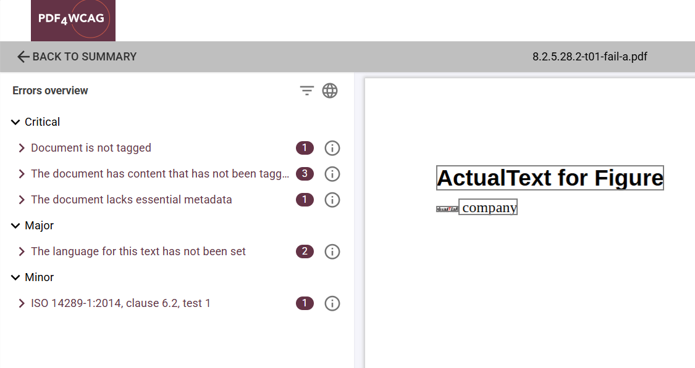
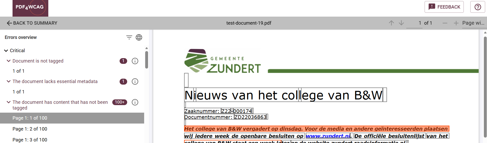
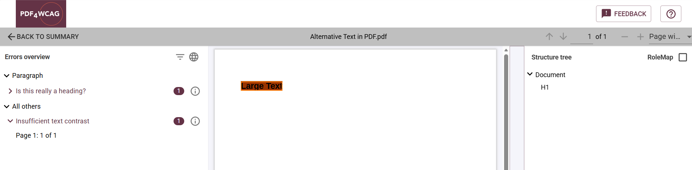
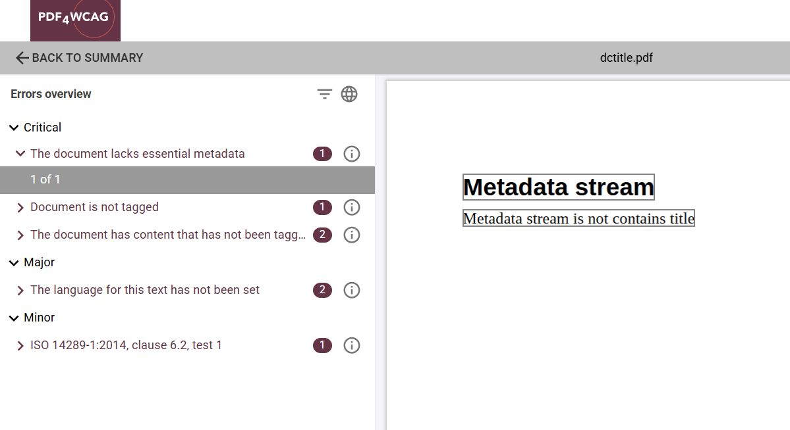
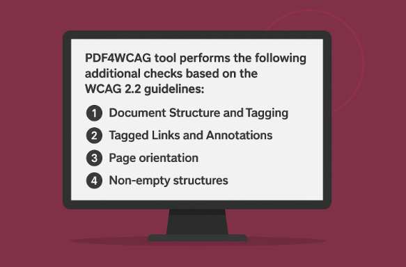

# What is WCAG for PDF

The **WCAG** (Web Content Accessibility Guidelines) is a set of recommendations for making web content more accessible. It is developed by W3C's 
[WAI](https://developer.mozilla.org/en-US/docs/Glossary/WAI), primarily for people with disabilities - but also for all user agents, including some highly 
limited devices or services, such as digital assistants.

## WCAG is not detailed for PDF

WCAG offers high-level principles such as making content **perceivable, operable, understandable, and robust** which apply broadly across digital formats. 
These principles help guide the creation of accessible content, but do not cover the technical specifics required to make a PDF truly accessible.

For example, **WCAG** will state that content should be _navigable_ and _readable with assistive technologies_, but **it won't explain how to properly 
tag a PDF**, define reading order, or add alternative text within a PDF file. These are **technical requirements unique to PDF**, which WCAG doesn't address in depth.

That's why, when it comes to PDFs, WCAG compliance is often interpreted through the lens of **PDF/UA (PDF Universal Accessibility)** - the ISO standard specifically 
designed for accessible PDF documents. While WCAG sets the accessibility goals, PDF/UA provides the technical blueprint for achieving them within the PDF format.

PDF/UA is an ISO standard that comes in two parts:
- [ISO 14289-1](https://pdfa.org/resource/iso-14289-pdfua/): Electronic document file format enhancement for accessibility – Part 1: Use of ISO 32000-1 (PDF/UA-1)
- [ISO 14289-2](https://pdfa.org/iso-14289-2-pdfua-2/): Document management applications — Electronic document file format enhancement for accessibility
Part 2: Use of ISO 32000-2 (PDF/UA-2)

## WCAG and PDF/UA are not the same

WCAG outlines **what** is required for the accessibility for PDFs, but not the **how** this is technically achieved. While WCAG outlines basic accessibility principles, 
it leaves many of the specific technical details for documents like PDFs to other standards, such as PDF/UA.

WCAG compliance for PDFs is often understood to be equivalent to PDF/UA compliance, with some minor modifications. To cut it short, 

_WCAG for PDF = PDF/UA + contrast requirements of WCAG - XMP metadata identification of PDF/UA + extra minor sanity checks_

These extra sanity checks are formally defined <https://pdf4wcag.com/validate/wcag-2-2-machine>. We provide more details below.

## Tagged PDF 

To ensure accessibility, the PDF document **must be tagged.** Tagging adds structure to the content, allowing assistive technologies to interpret and navigate 
the document correctly. **PDF/UA** (PDF Universal Accessibility) covers all relevant accessibility requirements for tagged PDFs, ensuring they meet the necessary 
standards for structure, reading order, and usability for people with disabilities.

**PDF4WCAG** visualizes structure tree in the right pane of the error preview. We do recommend our other tool [ngPDF](https://ngpdf.com/) for inspecting 
the structure elements of the document with all their properties and attributes.  

See also [Questions and Answers about Tagged PDF](https://pdfa.org/resource/tagged-pdf-q-a/) from PDF Association.

## Contrast checks

A notable difference between WCAG and PDF/UA is the **contrast requirements** found in WCAG, which are typically not covered in PDF/UA but are still essential for PDF accessibility.

WCAG [Success Criterion 1.4.3 Contrast (Minimum)](https://www.w3.org/TR/WCAG22/#contrast-minimum) provides all the details. In short, it requires all text to have contrast ratio at least 4.5:1,
with exception of large text (18pt or higher) which is required to have a contrast ratio at least 3:1.  

**PDF4WCAG** includes these contrast checks into both its WCAG 2.2 Machine and Human profiles and implements full support for all PDF color models with computing the contrast.

## Less Metadata requirements for WCAG

PDF/UA includes requirements for so-called identification Metadata, which identify PDF documents as PDF/UA compliant. While they provide very useful technical information and must 
be present in all PDF/UA-compliant documents, they are not explicitly covered by WCAG Success Criterions. So, when validating PDF document against WCAG profiles, **PDF4WCAG** relaxes these 
PDF/UA requirements and does not report missing identification metadata as a WCAG error.

It should be noted that there are some other Metadata that are still required by both PDF/UA and WCAG, such as presence of **dc:title** (Dublin Core) property in the PDF document metadata. 
It is equivalent to the WCAG [Success Criterion 2.4.2 Page Titled](https://www.w3.org/TR/WCAG22/#page-titled).  

## Basic sanity checks defined in PDF4WCAG

The **WCAG 2.2 Machine Validation** for PDFs offers a set of **basic sanity checks** to ensure that PDF documents meet essential accessibility criteria.

PDF4WCAG tool performs the following additional checks based on the **WCAG 2.2** guidelines:

#### 1. Document Structure and Tagging

Sanity checks ensure that the document is **properly tagged.** For PDF 1.7 (or earlier) documents this includes checking the provisions of ISO 32000-1 (PDF 1.7) specification
for the structure tree. In case of PDF 2.0 documents **PDF4WCAG** implements full validation of the structure tree against the schema defined in the additional ISO Technical Specification 
[32005 - PDF 1.7 and 2.0 structure namespace inclusion in ISO 32000-2](https://pdfa.org/resource/iso-32005/).

#### 2. Tagged Links and Annotations

Following WCAG [Success Criterion 2.4.9 Link Purpose (Link Only)](https://www.w3.org/TR/WCAG22/#link-purpose-link-only) **PDF4WCAG** this check ensures  
that links are tagged with meaningful, descriptive text rather than generic terms like "click here".

#### 3. Page orientation

Following WCAG [Success Criterion 1.3.4 Orientation](https://www.w3.org/TR/WCAG22/#orientation) all pages of the PDF document are required to have the same orientation.

#### 4. Non-empty structures

Empty paragraphs, section headings, table of content items may cause unexpected behaviour of screen readers and are detected and reported as potential WCAG issues. 

By using **PDF4WCAG**, you can automate this validation process, saving time and ensuring your PDFs comply with the latest accessibility standards effortlessly.
